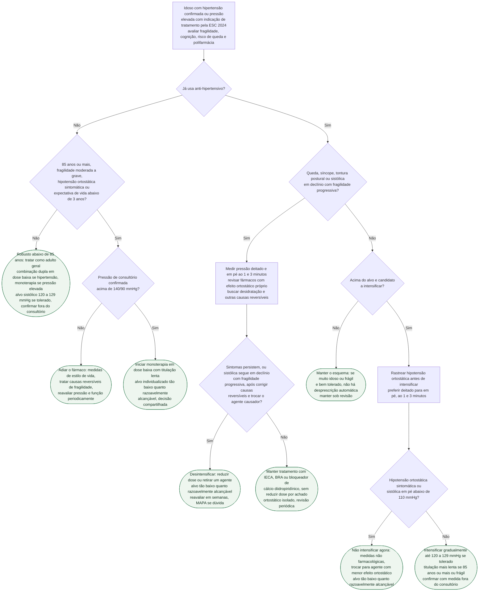

# Fluxograma: Hipertensão no idoso e no frágil — quando iniciar, alvo e desintensificação (ESC 2024)

A ESC 2024 fixou um alvo sistólico único de 120–129 mmHg para quem está em tratamento (Classe I, nível A) e, no mesmo movimento, nomeou quatro situações em que esse alvo não é o ponto de partida: idade de 85 anos ou mais, fragilidade moderada a grave, hipotensão ortostática sintomática e expectativa de vida limitada. Nessas situações o alvo passa a ser "tão baixo quanto razoavelmente alcançável", o início é em monoterapia com dose baixa e titulação lenta, e a desintensificação entra como conduta prevista quando a fragilidade progride ou surgem queda e hipotensão. O fluxograma geral da diretriz (ver fluxograma-hipertensao-arterial-esc-2024) para nessa bifurcação; este começa nela. Ele não repete a classificação de pressão arterial nem a regra de risco para tratar a faixa de pressão elevada.

## Árvore de decisão

## Quem sai do alvo de 120–129 mmHg

A diretriz enuncia o alvo com três ressalvas: o tratamento precisa ser bem tolerado, o alvo deve ser confirmado por medida fora do consultório, e alvos mais lenientes podem ser considerados em quem tem hipotensão ortostática sintomática, 85 anos ou mais, fragilidade moderada a grave ou expectativa de vida limitada. Quando o alvo de 120–129 mmHg não é perseguido, seja por intolerância seja por uma dessas condições, a recomendação é tratar até uma pressão "tão baixa quanto razoavelmente alcançável" (princípio ALARA). O texto acrescenta que a evidência dos ensaios de alvo intensivo vale até os 85 anos, que os dados acima dessa idade são inconclusivos e que adultos com fragilidade moderada a grave foram, em geral, excluídos dos ensaios.

A nota oficial da ESC sobre a diretriz registra como Classe I que o idoso abaixo de 85 anos sem fragilidade moderada a grave seja tratado pelas mesmas regras do adulto mais jovem, desde que o tratamento seja bem tolerado — é o ramo "Não" da primeira decisão deste fluxograma; lembrando que, na faixa de pressão elevada (120–139/70–89 mmHg) com indicação de fármaco, a diretriz manda começar em monoterapia, não em combinação. O raciocínio é por função, não por idade: quem é apto e independente nas atividades de vida diária se beneficia do tratamento guiado por diretriz como os mais jovens; quem perdeu função mas mantém as atividades de vida diária pede avaliação geriátrica mais detalhada antes de definir a estratégia; quem é funcionalmente dependente tem alvo personalizado e medicação suspensa quando apropriado (seção 8.7.3). A diretriz cita a escala clínica de fragilidade de Rockwood como instrumento intuitivo e validado contra mortalidade em 5 anos (Figura 21) — para os instrumentos e seus cortes, ver fragilidade-como-modificador-de-decisao-cardiovascular.

## Quando adiar o início e como iniciar no muito idoso ou frágil

Na presença de hipotensão ortostática sintomática antes do tratamento, idade de 85 anos ou mais, fragilidade moderada a grave clinicamente significativa ou expectativa de vida abaixo de 3 anos por alto risco competitivo (inclusive TFG abaixo de 30 mL/min/1,73 m2), a diretriz orienta adiar a consideração de fármaco até a pressão ultrapassar 140/90 mmHg — esses pacientes têm menor probabilidade de benefício líquido e de tolerar terapia intensiva. Isso muda o limiar de início, não o direito ao tratamento: a seção 9.3.2 é explícita em que muito idosos e frágeis não devem ser privados do benefício potencial de baixar a pressão, com a decisão personalizada como prioridade.

Uma vez decidido tratar, o início é diferente do adulto geral, em que a combinação dupla em dose baixa é a regra: no muito idoso e no frágil, "iniciar com monoterapia, titulação mais lenta e doses mais baixas deve ser considerado", e começar com combinação não é aconselhado a menos que a pressão esteja muito alta. A diretriz não fixa doses numéricas para esse grupo.

| Escolha do agente no muito idoso ou frágil (ESC 2024, seção 9.3.3) | Posição da diretriz |
|---|---|
| Bloqueador de cálcio diidropiridínico de ação longa | Pode ser o agente inicial |
| IECA, ou BRA se contraindicado | Acrescentar para atingir controle |
| Tiazídico ou similar em dose baixa | Depois dos anteriores; evitar em gota, hipotensão ortostática ou distúrbio miccional |
| Betabloqueador | Menos desejável: reduz frequência, causa fadiga, amplifica a onda sistólica em artérias rígidas |
| Vasodilatador direto e betabloqueador vasodilatador | Associados a maior risco de ortostatismo |
| Alfabloqueador (doxazosina, prazosina, terazosina) | Menos desejável: ortostatismo e quedas em 85 anos ou mais |

## Rastrear hipotensão ortostática antes de intensificar

A definição usada é queda de 20 mmHg ou mais na sistólica e/ou 10 mmHg ou mais na diastólica, medida em pé ao 1 e/ou 3 minutos após 5 minutos sentado ou deitado. A diretriz prefere a manobra deitado para em pé, porque a sentado para em pé subdetecta, e considera a MAPA de rotina inadequada para o diagnóstico formal. O rastreio antes de intensificar tem razão explícita: os ensaios de alvo intensivo podem não se generalizar a quem tem hipotensão ortostática, sobretudo quando grave (sistólica em pé abaixo de 110 mmHg) ou sintomática, e o sintoma limita a tolerância a esquemas mais intensos.

O achado assintomático, porém, não é motivo para segurar o tratamento: a frequência de hipotensão ortostática não aumenta nos braços intensivos dos ensaios randomizados, e há evidência de que o tratamento mais intensivo pode até reduzi-la — a metanálise de dados individuais que sustenta essa afirmação está em hipotensao-ortostatica-nao-e-motivo-para-desescalonar-o-anti-hipertensivo. IECA, BRA e bloqueadores de cálcio diidropiridínicos têm menor impacto sobre o ortostatismo, e o efeito adverso, quando ocorre, costuma aparecer nas primeiras 2 semanas após iniciar ou intensificar.

## Queda, síncope ou hipotensão em quem já trata: desintensificar sem automatismo

Para quem tolera bem o tratamento, não há necessidade automática de desprescrever, mas a conduta fica sob revisão. Com fragilidade progressiva a sistólica tende a cair espontaneamente, e a desprescrição de um anti-hipertensivo pode se tornar necessária. O caminho da diretriz é ordenado: revisar as medicações atuais para identificar anti-hipertensivos que se tornaram contraindicados por nova comorbidade ou por interação; procurar e tratar causas reversíveis, inclusive suspender fármacos desencadeantes (alfabloqueadores, betabloqueadores, diuréticos, nitratos, antidepressivos, antipsicóticos); trocar para agente com menor efeito ortostático; e só então reduzir dose. A MAPA pode ajudar a guiar a desprescrição, ao detectar hipotensão ortostática ou pressão muito variável sem tamponamento autonômico. A regra explícita da seção 9.5 é que tratar hipotensão ortostática com hipertensão supina "não é reduzir automaticamente os anti-hipertensivos". A queda em si, quando inexplicada, segue o caminho de avaliação de fluxograma-sincope-e-queda-no-idoso-estratificacao-de-risco-na-emergencia.

A seção 8.7.3 registra o contrapeso: adultos acima de 75 anos da população geral que preencheriam os critérios do SPRINT tiveram taxa de quedas com lesão e síncope quase cinco vezes maior que a do braço padrão do ensaio, sinal de viés de participante saudável que limita a generalização dos ensaios ao idoso da rotina.

## O que sustenta o alvo de 120–129 mmHg no idoso robusto

| Ensaio | População | Alvos comparados | Sistólica atingida | Desfecho primário | Segurança |
|---|---|---|---|---|---|
| SPRINT, subgrupo de 75 anos ou mais (Williamson 2016) | 2.636 ambulatoriais, média 79,9 anos, sem diabetes | Abaixo de 120 vs. abaixo de 140 mmHg | — | 102 vs. 148 eventos, HR 0,66 (IC95% 0,51–0,85); mortalidade HR 0,67 (IC95% 0,49–0,91) | Eventos adversos sérios 48,4% vs. 48,3%; hipotensão 2,4% vs. 1,4%; quedas com lesão 4,9% vs. 5,5% (HR 0,91) |
| STEP (Zhang 2021) | 8.511 chineses de 60 a 80 anos | 110 a abaixo de 130 vs. 130 a abaixo de 150 mmHg | 127,5 vs. 135,3 mmHg em 1 ano | 3,5% vs. 4,6%, HR 0,74 (IC95% 0,60–0,92) | Hipotensão mais frequente no braço intensivo; demais desfechos de segurança e renais sem diferença |
| HYVET (Beckett 2008, via acervo) | 3.845 com 80 anos ou mais, média 83,6 anos, sistólica de entrada 160 mmHg ou mais | Tratar para 150/80 mmHg vs. placebo | — | Mortalidade total reduzida em 21%; insuficiência cardíaca reduzida em 64% | Menos eventos adversos sérios no grupo ativo |

Os três ensaios sustentam tratar e, no ambulatorial robusto, tratar com alvo intensivo; nenhum deles incluiu de forma representativa o frágil moderado a grave ou o paciente de 85 anos ou mais. Leitura conjunta e ressalvas de seleção em hipertensao-sistolica-isolada-e-meta-pressorica-no-muito-idoso-hyvet-sprint-e-step.

## Limitações e o que confirmar

- Classe e nível das recomendações específicas para muito idoso ou frágil (Tabela de Recomendação 23) e para hipotensão ortostática (Tabela de Recomendação 24) da ESC 2024: as tabelas são imagens no texto online e não foram lidas — VERIFICAÇÃO HUMANA NECESSÁRIA. As classes citadas neste fluxograma (alvo sistólico 120–129 mmHg, Classe I, nível A) vêm do texto corrido da seção 8.5.
- A diretriz não define limite inferior de idade para "idoso"; a faixa "65 a 84 anos, robusto" usada no enunciado deste fluxograma é enquadramento prático — o texto fala em evidência de alvo intensivo "até 85 anos" e em função, não em idade mínima.
- A diretriz não fixa doses numéricas de início para o muito idoso ou frágil; "dose baixa" é a expressão do texto. As doses do HYVET (indapamida 1,5 mg de liberação sustentada, perindopril 2 ou 4 mg) vêm do documento do acervo, não deste fluxograma.
- O corte de sistólica em pé abaixo de 110 mmHg qualifica hipotensão ortostática grave na seção 9.5 e é usado aqui como gatilho para não intensificar; a diretriz não o apresenta como recomendação numerada.
- A Figura 21 (avaliação de fragilidade pela escala clínica de Rockwood) é imagem e seus cortes operacionais não foram lidos; os instrumentos estão descritos em fragilidade-como-modificador-de-decisao-cardiovascular.
- A meta brasileira (SBC 2025, abaixo de 130/80 mmHg) difere da europeia; este fluxograma segue exclusivamente a ESC 2024.

## Tudo com Tudo

- [Fluxograma: Pressão arterial elevada e hipertensão — da medida ao alvo (ESC 2024)](/biblioteca/fluxograma-hipertensao-arterial-esc-2024)
- [Hipertensão Arterial e Pressão Arterial Elevada (ESC 2024)](/biblioteca/hipertensao-arterial-e-pressao-arterial-elevada-esc-2024)
- [Hipertensão Sistólica Isolada e Meta Pressórica no Muito Idoso: o que HYVET, SPRINT e STEP Mostraram, e Onde Divergem](/biblioteca/hipertensao-sistolica-isolada-e-meta-pressorica-no-muito-idoso-hyvet-sprint-e-step)
- [Metas Terapêuticas no Muito Idoso (80+): Hipertensão, Dislipidemia e Anticoagulação Além da Extrapolação de Ensaios Mais Jovens](/biblioteca/metas-terapeuticas-cardiovasculares-no-muito-idoso)
- [Fragilidade como Modificador de Decisão Cardiovascular: Avaliação e Impacto em TAVI, Cirurgia Valvar e Revascularização](/biblioteca/fragilidade-como-modificador-de-decisao-cardiovascular)
- [Hipotensão Ortostática Não é Motivo para Desescalonar o Anti-Hipertensivo](/biblioteca/hipotensao-ortostatica-nao-e-motivo-para-desescalonar-o-anti-hipertensivo)
- [Fluxograma: síncope e queda no idoso — estratificação de risco na emergência](/biblioteca/fluxograma-sincope-e-queda-no-idoso-estratificacao-de-risco-na-emergencia)
