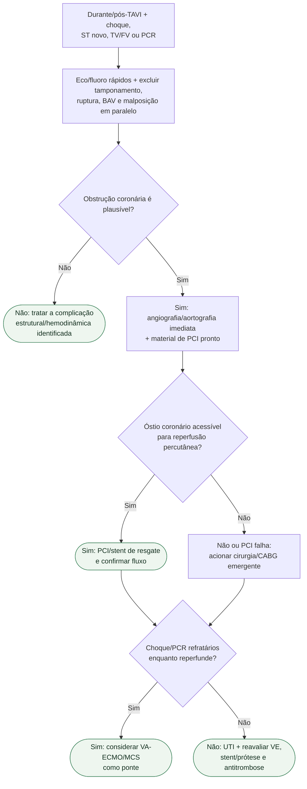

# Obstrução coronária após TAVI

```mermaid
flowchart TD
  R0["Durante/pós-TAVI + choque,<br/>ST novo, TV/FV ou PCR"]
  P1["Eco/fluoro rápidos + excluir tamponamento,<br/>ruptura, BAV e malposição em paralelo"]
  D1{"Obstrução coronária é plausível?"}
  C1(["Não: tratar a complicação<br/>estrutural/hemodinâmica identificada"])
  P2["Sim: angiografia/aortografia imediata<br/>+ material de PCI pronto"]
  D2{"Óstio coronário acessível<br/>para reperfusão percutânea?"}
  C2(["Sim: PCI/stent de resgate<br/>e confirmar fluxo"])
  P3["Não ou PCI falha:<br/>acionar cirurgia/CABG emergente"]
  D3{"Choque/PCR refratários<br/>enquanto reperfunde?"}
  C3(["Sim: considerar VA-ECMO/MCS<br/>como ponte"])
  C4(["Não: UTI + reavaliar VE,<br/>stent/prótese e antitrombose"])

  R0 --> P1
  P1 --> D1
  D1 -->|"Não"| C1
  D1 -->|"Sim"| P2
  P2 --> D2
  D2 -->|"Sim"| C2
  D2 -->|"Não"| P3
  C2 --> D3
  P3 --> D3
  D3 -->|"Sim"| C3
  D3 -->|"Não"| C4

  classDef conduta fill:#eef6ef,stroke:#2f7a4f,color:#12301f;
  class C1,C2,C3,C4 conduta;
```

## Regra prática

**Pós-TAVI, choque + ST é uma complicação mecânica coronária até ser excluída por angiografia.**