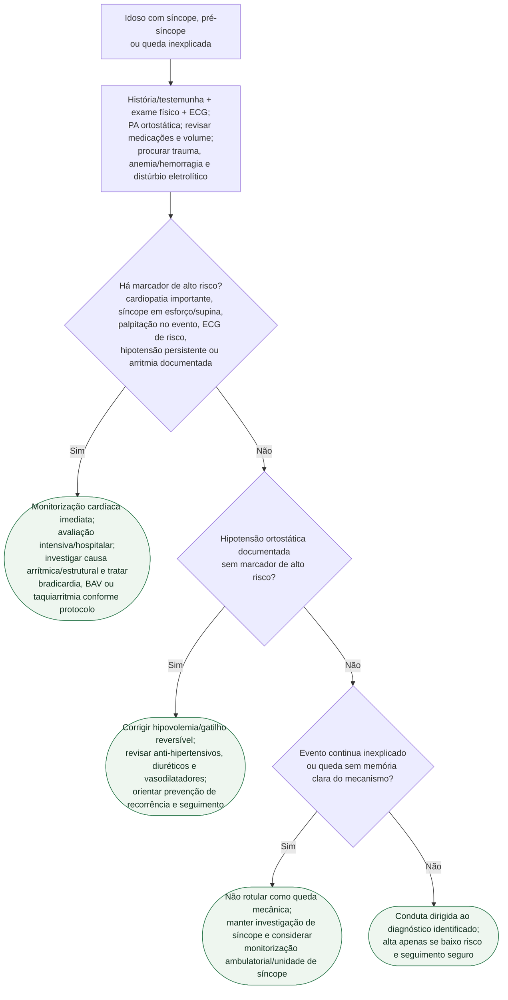

# Síncope e queda no idoso

## Segurança

Em pessoa idosa, uma queda sem mecanismo claro pode ser apresentação de síncope. O rótulo “queda mecânica” não deve encerrar a avaliação antes de ECG, PA ortostática e revisão da medicação.
