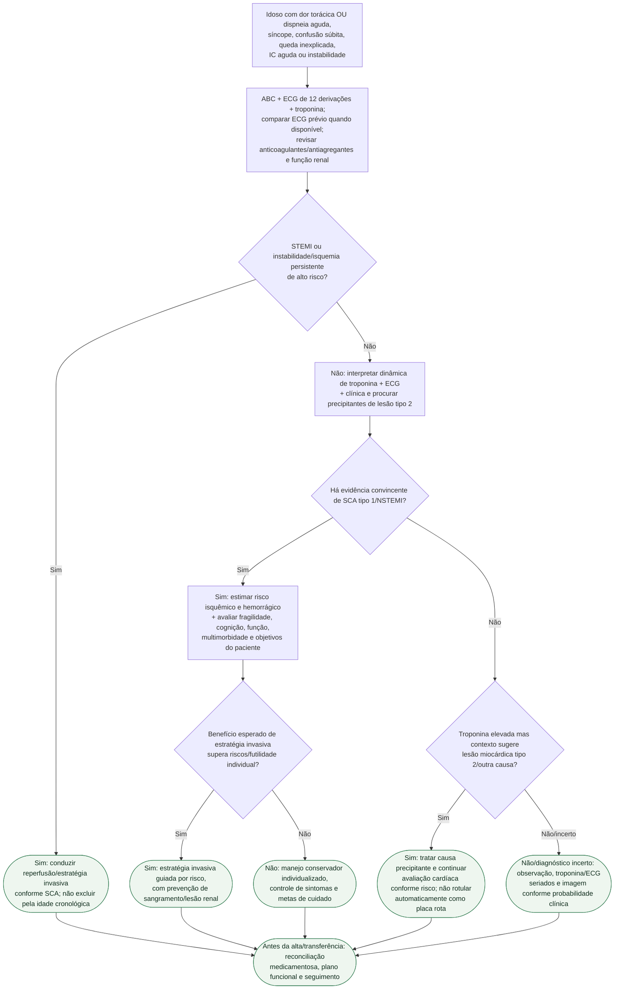

# SCA no idoso frágil/apresentação atípica

## Regra prática

No idoso, **a apresentação pode ser não dolorosa; a fragilidade entra depois que a emergência foi reconhecida**, para calibrar benefício, risco e objetivos — não para impedir o diagnóstico ou negar tratamento automaticamente.
