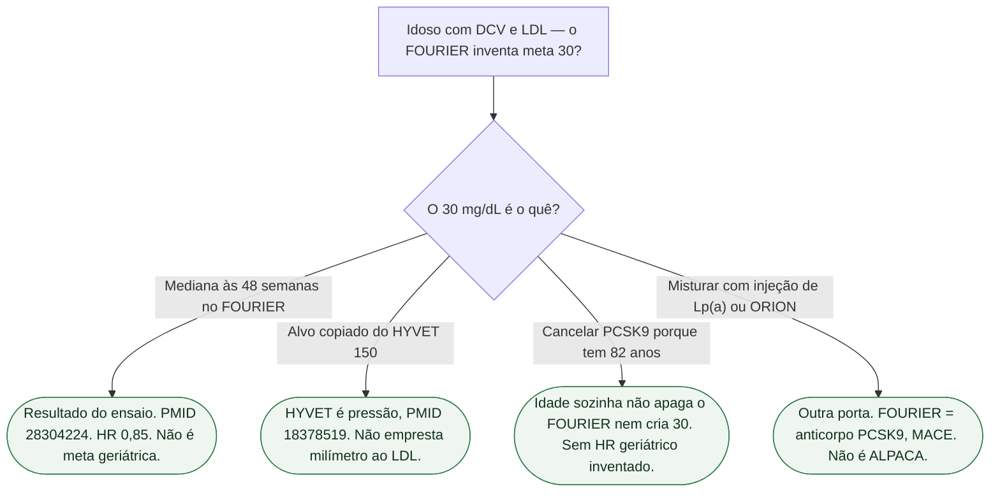

# FOURIER no idoso não cria meta de LDL inventada

A frase do plantão — «tem 82 anos, o FOURIER autoriza LDL 30» — **não** é uma meta geriátrica. O **30 mg/dL** é a **mediana alcançada no ensaio**, em quem já tinha doença aterosclerótica e estatina. Não é um alvo copiado do HYVET. O HYVET (Beckett; PMID **18378519**) é ensaio de **pressão** no octogenário da comunidade, com alvo **do protocolo** **150/80 mmHg**. Não é lipídio. Não empresta o milímetro para o colesterol.

A porta do 150 da idade já existe: [HYVET não cria meta 150 no idoso de 2025](/biblioteca/hyvet-nao-cria-meta-150-no-idoso-de-2025). **Não se redesenha.**

## O que o FOURIER mostrou — abstract PubMed aberto

Sabatine MS et al. *N Engl J Med*. 2017;376:1713-1722. DOI 10.1056/NEJMoa1615664. PMID **28304224**. NCT01764633. Abstract do PubMed **aberto nesta sessão**.

**27.564** pessoas com doença cardiovascular aterosclerótica e LDL-C **≥70 mg/dL** (1,8 mmol/L) **já em estatina**. Evolocumabe subcutâneo **140 mg** a cada 2 semanas **ou** **420 mg** mensal versus placebo combinado. Primário: morte cardiovascular, infarto, AVC, internamento por angina instável ou revascularização coronariana. Secundário-chave: morte cardiovascular, infarto ou AVC. Mediana de seguimento **2,2 anos**.

Às 48 semanas, a redução percentual média de mínimos quadrados do LDL-C, versus placebo, foi **59%**, da mediana basal **92 mg/dL** (2,4 mmol/L) para **30 mg/dL** (0,78 mmol/L); P<0,001.

- Primário: **1344 (9,8%)** versus **1563 (11,3%)**; **HR 0,85**; IC95% **0,79–0,92**; P<0,001
- Secundário-chave: **816 (5,9%)** versus **1013 (7,4%)**; **HR 0,80**; IC95% **0,73–0,88**; P<0,001

O abstract afirma consistência nos subgrupos-chave, inclusive o quartil mais baixo de LDL basal (mediana **74 mg/dL**). **Não lista HR por idade.** Eventos adversos sem diferença significativa no abstract (incluindo diabetes de início e eventos neurocognitivos), exceto reação no local da injeção: **2,1%** versus **1,6%**.

Conclusão dos autores: inibir PCSK9 com evolocumabe **sobre** estatina baixou o LDL à mediana de **30 mg/dL** e reduziu eventos cardiovasculares. Sem n por braço inventado. Sem NNT. Sem subgrupo geriátrico inventado.

## O que o FOURIER não é

Não é meta de LDL **do idoso**. O **30 mg/dL** é o que o braço ativo **atingiu** às 48 semanas, na mediana — DCV aterosclerótica, estatina, LDL de entrada ≥70. Responde: baixar o LDL abaixo dos alvos então vigentes reduz o composto. **Não** responde: «qual é o alvo geriátrico».

Não é o HYVET. O HYVET trata hipertensão em **≥80 anos** versus placebo. Alvo **do protocolo**: **150/80 mmHg**. Identidade PMID **18378519**. Números na ficha-irmã — **não** transcritos aqui. Tratar o octogenário vence não tratar **na pressão**. Isso **não** autoriza copiar 150 para o LDL, inventar «meta 30 no idoso porque o FOURIER», nem cancelar PCSK9 «porque o HYVET autoriza 150».

Não é ORION-4. Não é ALPACA. A porta anti-mistura mora em [FOURIER: evolocumabe não é ORION e não é ALPACA](/biblioteca/fourier-evolocumabe-nao-e-orion-nem-alpaca) — **não se redesenha**. Evolocumabe é anticorpo anti-PCSK9 com desfecho clínico. Idade **não** unifica PCSK9, siRNA de PCSK9 e siRNA de Lp(a).

## O que não misturar nesta consulta

- **Mediana alcançada ≠ meta geriátrica.** 30 mg/dL é resultado do FOURIER, não alvo copiado da idade.
- **HR 0,85 ≠ licença para inventar alvo no ≥80.** É o composto primário da população do ensaio.
- **HYVET ≠ FOURIER.** Pressão versus lipídio. O 150/80 do protocolo **não** vira 30 de LDL.
- **Subgrupo-chave do abstract ≠ HR do idoso.** Quartil de LDL basal **não** é faixa etária. Sem HR geriátrico nesta ficha.
- **Estatina de fundo não some.** O evolocumabe foi testado **sobre** estatina, não no lugar dela.

## Tudo com Tudo

- **Cardiologia geriátrica:** esta porta. Irmãs: [HYVET não cria meta 150 no idoso de 2025](/biblioteca/hyvet-nao-cria-meta-150-no-idoso-de-2025), [iSGLT2 no idoso não herda o HYVET](/biblioteca/sglt2-no-idoso-nao-herda-hyvet), [PREVENT no idoso: a idade não cria segunda meta de pressão](/biblioteca/prevent-no-idoso-a-idade-nao-cria-segunda-meta-de-pressao).
- **Prevenção e lipídios:** [FOURIER: evolocumabe não é ORION e não é ALPACA](/biblioteca/fourier-evolocumabe-nao-e-orion-nem-alpaca). LDL continua estatina ± ezetimiba ± PCSK9 se couber.
- **Doença coronariana:** população do FOURIER é DCV aterosclerótica, não idoso só com pressão.
- **Farmacologia:** evolocumabe 140 mg 2/2 sem ou 420 mg/mês SC, **sobre** estatina.
- **Comunicação clínica:** mediana 30 ≠ alvo do octogenário. 150 do HYVET ≠ 30 do FOURIER.
- **Hipertensão:** o 150 permanece na porta do HYVET, não nesta.

### Leituras conectadas

- [Fragilidade não cancela a meta de pressão nem a reabilitação cardíaca](/biblioteca/fragilidade-nao-cancela-meta-pressao-nem-rc)
- [HYVET não cria meta 150 no idoso de 2025](/biblioteca/hyvet-nao-cria-meta-150-no-idoso-de-2025)
