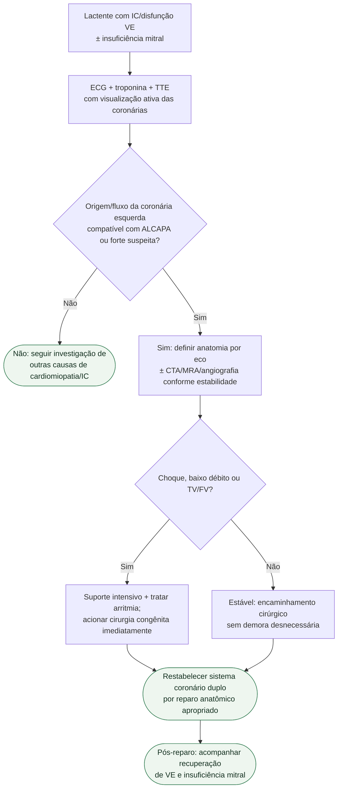

# ALCAPA no lactente

```mermaid
flowchart TD
  R0["Lactente com IC/disfunção VE<br/>± insuficiência mitral"]
  P1["ECG + troponina + TTE<br/>com visualização ativa das coronárias"]
  D1{"Origem/fluxo da coronária esquerda<br/>compatível com ALCAPA ou forte suspeita?"}
  C1(["Não: seguir investigação de<br/>outras causas de cardiomiopatia/IC"])
  P2["Sim: definir anatomia por eco<br/>± CTA/MRA/angiografia conforme estabilidade"]
  D2{"Choque, baixo débito ou TV/FV?"}
  P3["Suporte intensivo + tratar arritmia;<br/>acionar cirurgia congênita imediatamente"]
  P4["Estável: encaminhamento cirúrgico<br/>sem demora desnecessária"]
  C2(["Restabelecer sistema coronário duplo<br/>por reparo anatômico apropriado"])
  C3(["Pós-reparo: acompanhar recuperação<br/>de VE e insuficiência mitral"])

  R0 --> P1
  P1 --> D1
  D1 -->|"Não"| C1
  D1 -->|"Sim"| P2
  P2 --> D2
  D2 -->|"Sim"| P3
  D2 -->|"Não"| P4
  P3 --> C2
  P4 --> C2
  C2 --> C3

  classDef conduta fill:#eef6ef,stroke:#2f7a4f,color:#12301f;
  class C1,C2,C3 conduta;
```

## Regra prática

ALCAPA não é tratada definitivamente com diurético/inotrópico: **é uma causa anatômica de isquemia que exige restauração de fluxo coronário sistêmico**.