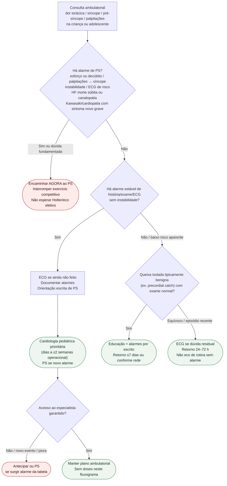

# Fluxograma ambulatorial pediátrico: dor / síncope / palpitações — destino

Prosa: [`sinalizadores-ambulatoriais-pediatria-dor-sincope-palpitacoes-ps-vs-especialista`](sinalizadores-ambulatoriais-pediatria-dor-sincope-palpitacoes-ps-vs-especialista.md). Palpitações: [`palpitacoes-ambulatoriais-na-crianca-quando-ps-vs-cardiologista-pediatrico`](palpitacoes-ambulatoriais-na-crianca-quando-ps-vs-cardiologista-pediatrico.md).

## Árvore de decisão

## Notas

- **D1** = gate de segurança (ACC/AHA/HRS 2017 / ESC 2018 / Sanatani + alarmes de dor Fogliazza).
- **D2** = alarme estável → especialista, não alta sem plano.
- **D3** = baixo risco aparente ainda recebe educação de alarmes; eco não é rastreio indiscriminado.
- Não decide doses, ablação, CDI nem indicação cirúrgica.
