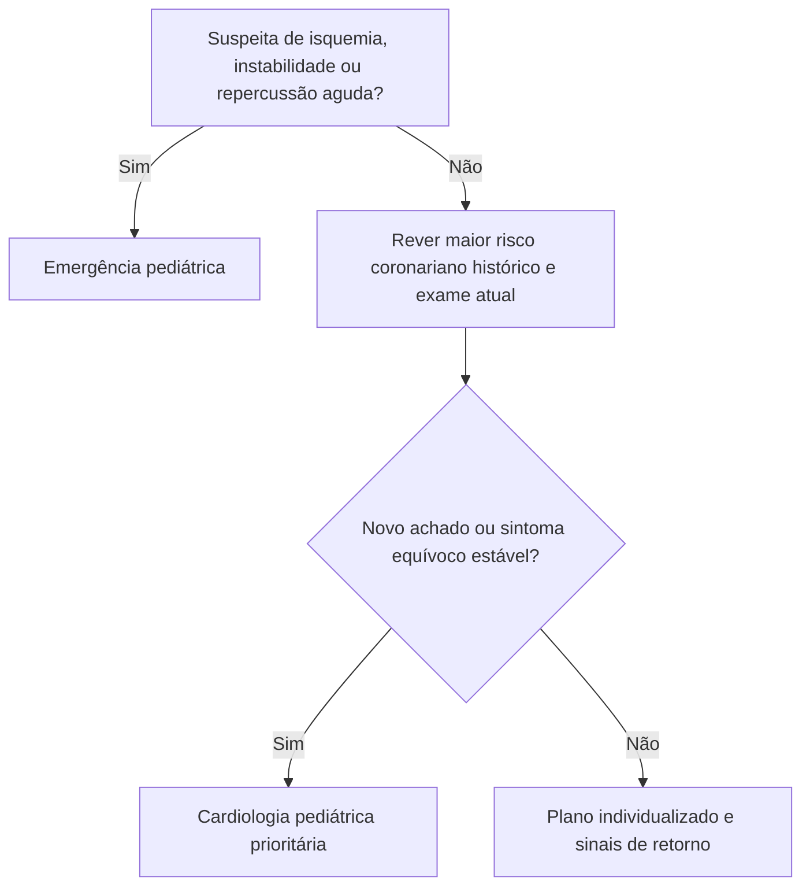

# Fluxograma ambulatorial: seguimento pós-Kawasaki / MIS-C — PS vs. especialista

Consulte o protocolo de sinalizadores do mesmo pacote para critérios e limites. Reavalie o destino após exames e diante de qualquer piora.

## Navegação

- [`sinalizadores-ambulatoriais-seguimento-pos-kawasaki-e-mis-c-ps-vs-especialista`](/biblioteca/sinalizadores-ambulatoriais-seguimento-pos-kawasaki-e-mis-c-ps-vs-especialista)
- [`dor-toracica-ou-sincope-no-seguimento-pos-cal-kawasaki-destino-ambulatorial`](/biblioteca/dor-toracica-ou-sincope-no-seguimento-pos-cal-kawasaki-destino-ambulatorial)
