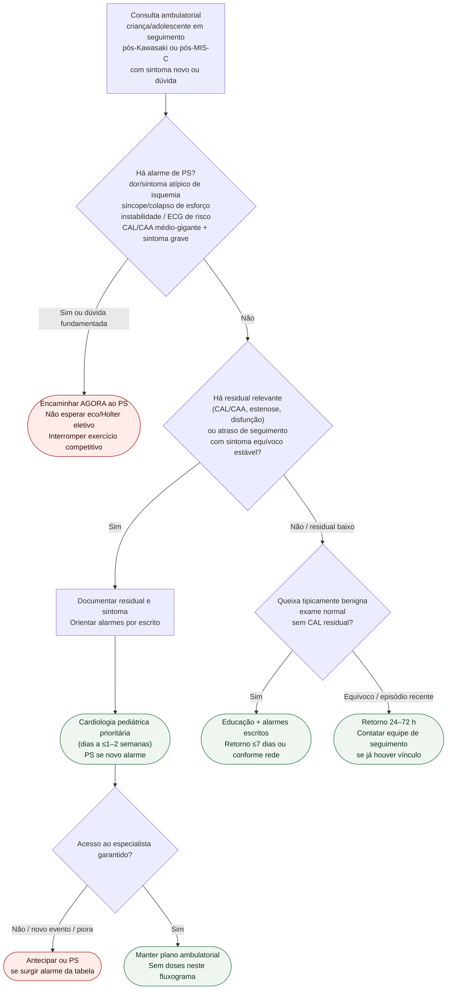

# Fluxograma ambulatorial: seguimento pós-Kawasaki / MIS-C — destino

Prosa: [`sinalizadores-ambulatoriais-seguimento-pos-kawasaki-e-mis-c-ps-vs-especialista`](sinalizadores-ambulatoriais-seguimento-pos-kawasaki-e-mis-c-ps-vs-especialista.md). Braço dor/síncope com CAL: [`dor-toracica-ou-sincope-no-seguimento-pos-cal-kawasaki-destino-ambulatorial`](dor-toracica-ou-sincope-no-seguimento-pos-cal-kawasaki-destino-ambulatorial.md).

## Árvore de decisão

## Notas

- **D1** = gate de segurança (Brogan PMID 31843876 + AHA 2017 / JCS 2020).
- **D2** = residual coronariano/miocárdico ou atraso de calendário → especialista, não alta sem plano.
- **D3** = baixo residual ainda recebe educação de alarmes; não confunde com pacote geral #863.
- Não decide doses, anticoagulação, trombólise nem indicação de cateterismo.
