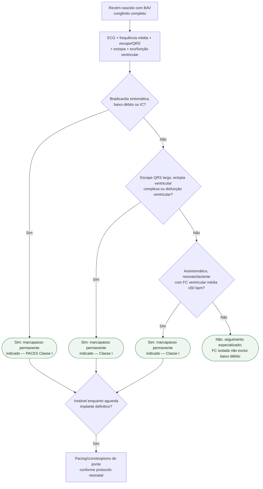

# BAV congênito completo neonatal

## Regra prática

**≤50 bpm é critério de pacing no neonato/lactente assintomático, mas não é um corte de segurança acima do qual o bebê esteja automaticamente bem.**