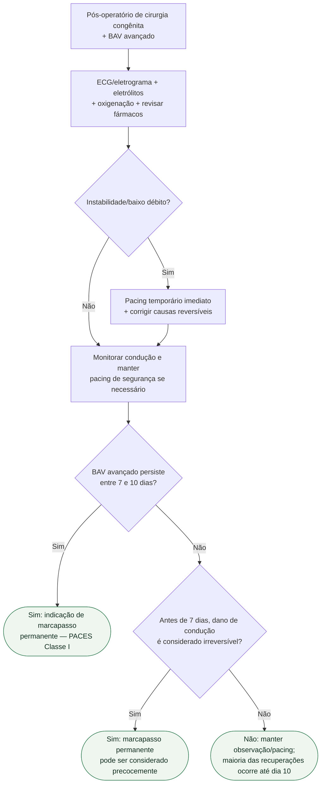

# BAV pós-operatório após cirurgia congênita

## Regra prática

A janela de **7–10 dias** existe porque grande parte da condução recuperável volta nesse período; ela não deve atrasar pacing necessário nem impedir implante precoce quando recuperação é improvável.