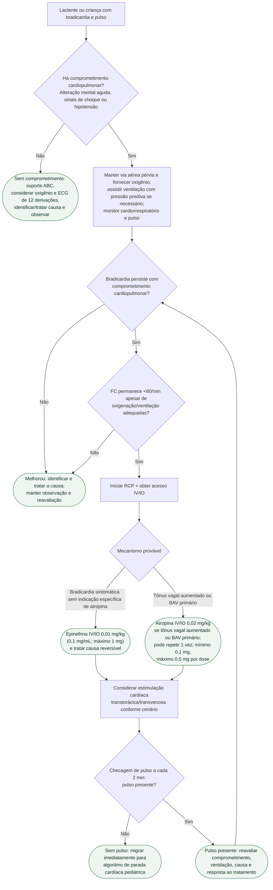

# Bradicardia pediátrica com pulso

## Ponto-chave

Na bradicardia pediátrica, **ventilação eficaz vem antes da escalada farmacológica**. O limiar de FC <60/min leva à RCP somente quando a criança continua com comprometimento cardiopulmonar apesar de oxigenação e ventilação adequadas.
