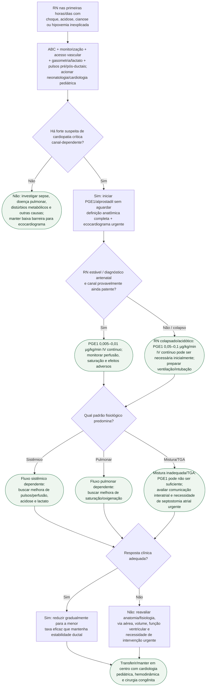

# Colapso neonatal canal-dependente

## Segurança

PGE1 pode causar apneia, hipotensão e febre. Doses mais altas são reservadas ao neonato colapsado quando o benefício de reabrir rapidamente o canal supera o risco; após resposta, reduzir para a menor dose eficaz.
