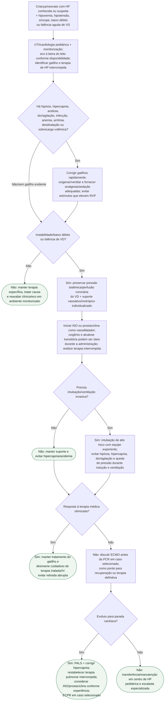

# Crise de hipertensão pulmonar pediátrica

## Nota de evidência

O PALS 2025 recomenda iNO ou prostaciclina como terapia vasodilatadora inicial (classe 1, B-R) e permite considerar ECMO na refratariedade (classe 2b, C-LD). A prática farmacológica ainda varia muito entre centros; por isso, a árvore **não força doses universais de iNO, prostaciclina, milrinona ou vasopressor**.

## Tudo com Tudo

- [Protocolo da crise de hipertensão pulmonar pediátrica](crise-de-hipertensao-pulmonar-pediatrica-e-falencia-aguda-de-vd.md)
- [HPPRN: diagnóstico e escada terapêutica](hipertensao-pulmonar-persistente-do-recem-nascido-fisiopatologia-diagnostico-e-escada-terapeutica.md)
- [Fluxograma da crise de HPPRN](fluxograma-crise-de-hipertensao-pulmonar-persistente-do-recem-nascido.md)
