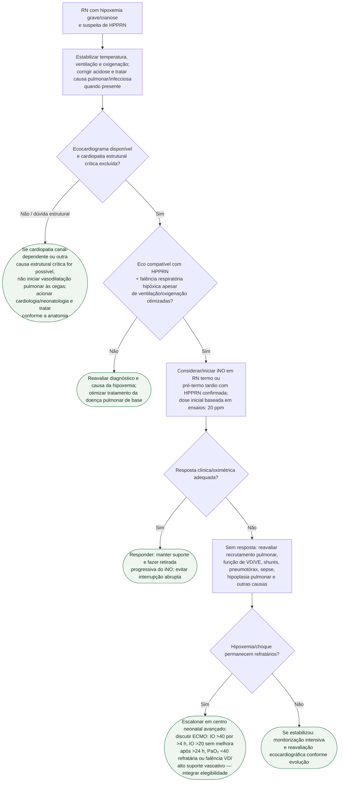

# Crise de hipertensão pulmonar persistente do recém-nascido

## Pontos críticos

- O ecocardiograma confirma a fisiologia de HPPRN e ajuda a excluir cardiopatias congênitas cianogênicas/canal-dependentes antes da vasodilatação pulmonar.
- Em recém-nascidos a termo e pré-termo tardios com falência respiratória hipóxica associada à HPPRN, iNO é terapia baseada em evidência; **20 ppm** é a dose inicial usada em ensaios e recomendações contemporâneas.
- Uso rotineiro de iNO em prematuros não é recomendado; situações de resgate específicas exigem avaliação neonatal especializada.
- A ELSO inclui **IO >40 por mais de 4 horas** entre as possíveis indicações de ECMO neonatal, mas também inclui outros padrões de refratariedade. O número não é uma ordem automática de canulação nem deve ser aguardado para iniciar a discussão com o centro ECMO.

## Tudo com Tudo

- [Protocolo de HPPRN: diagnóstico e escada terapêutica](hipertensao-pulmonar-persistente-do-recem-nascido-fisiopatologia-diagnostico-e-escada-terapeutica.md)
- [Crise de hipertensão pulmonar pediátrica e falência aguda de VD](crise-de-hipertensao-pulmonar-pediatrica-e-falencia-aguda-de-vd.md)
