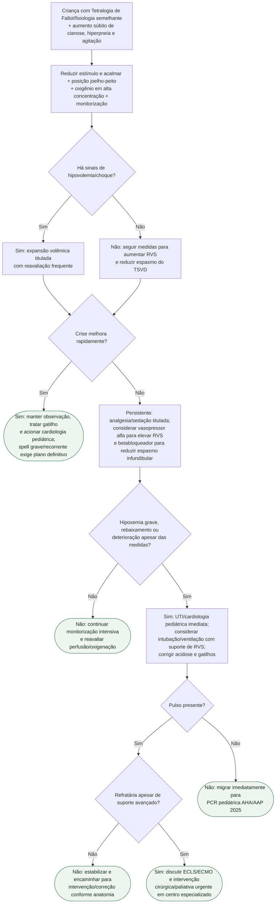

# Crise hipercianótica na Tetralogia de Fallot

## Regra fisiológica

O objetivo é quebrar o ciclo de **agitação → maior obstrução dinâmica do TSVD/queda relativa da RVS → mais shunt direita-esquerda → pior hipóxia/acidemia**. Por isso, joelho-peito, redução de estímulo, pré-carga adequada e aumento de RVS são medidas centrais.
