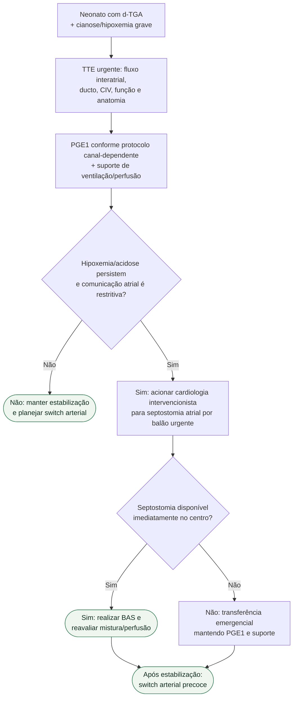

# d-TGA com mistura atrial restritiva

## Regra prática

**Ducto patente não garante mistura suficiente.** Se o forame oval é restritivo e o neonato continua hipóxico, BAS é a ponte que muda a fisiologia.