# Descompensação aguda da circulação de Fontan

```mermaid
flowchart TD
  R0["Fontan + queda de saturação, síncope,<br/>baixo débito, congestão ou choque"]
  P1["Comparar SpO2 com basal + ECG + eco + perfusão;<br/>acionar cardiologia congênita"]
  D1{"Há arritmia importante?"}
  P2["Tratar arritmia conforme estabilidade;<br/>priorizar restauração hemodinâmica do ritmo"]
  D2{"Há hipovolemia/desidratação<br/>sem congestão dominante?"}
  P3["Reposição volêmica cautelosa e reavaliada;<br/>não existe bolus universal Fontan"]
  D3{"Há congestão venosa importante?"}
  P4["Decongestão cautelosa;<br/>evitar reduzir excessivamente a pré-carga"]
  D4{"Hipoxemia/baixo débito persistem<br/>ou causa segue incerta?"}
  P5["Procurar TEP, obstrução do Fontan/AP,<br/>shunts/colaterais, aumento de RVP,<br/>disfunção ventricular/valvar"]
  D5{"Necessita ventilação invasiva?"}
  P6["Intubação de alto risco:<br/>preparar hemodinâmica, evitar hipóxia/hipercapnia/acidose<br/>e minimizar pressão positiva compatível com oxigenação"]
  D6{"Choque/refratariedade apesar<br/>da correção fisiológica?"}
  P7["Cateterismo/intervenção se lesão corrigível;<br/>discutir MCS/transplante em centro especializado"]
  C1(["Estabilizado: seguimento ACHD/pediátrico<br/>e investigação do mecanismo da falência"])

  R0 --> P1
  P1 --> D1
  D1 -->|"Sim"| P2
  D1 -->|"Não"| D2
  P2 --> D2
  D2 -->|"Sim"| P3
  D2 -->|"Não"| D3
  P3 --> D3
  D3 -->|"Sim"| P4
  D3 -->|"Não"| D4
  P4 --> D4
  D4 -->|"Sim"| P5
  D4 -->|"Não"| C1
  P5 --> D5
  D5 -->|"Sim"| P6
  D5 -->|"Não"| D6
  P6 --> D6
  D6 -->|"Sim"| P7
  D6 -->|"Não"| C1
  P7 --> C1

  classDef conduta fill:#eef6ef,stroke:#2f7a4f,color:#12301f;
  class C1 conduta;
```

## Regra prática

No Fontan, **retorno venoso e baixa RVP sustentam o débito**. Antes de adicionar mais drogas, procure o que está bloqueando o fluxo: hipovolemia, pressão intratorácica, arritmia, trombo/obstrução ou doença pulmonar.