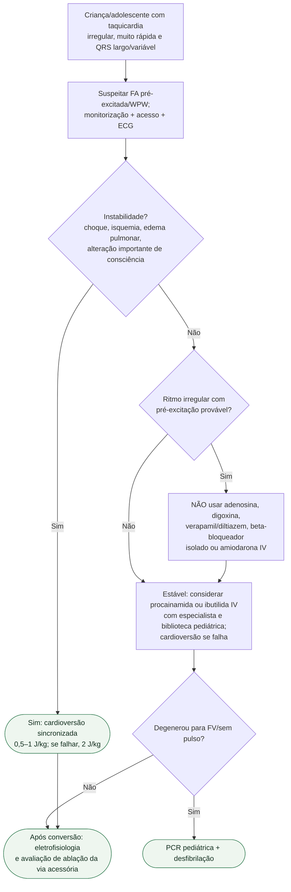

# FA pré-excitada/WPW pediátrica

## Regra prática

Adenosina é excelente em algumas TSVs pediátricas, mas **pode ser perigosa na FA pré-excitada**. A irregularidade do ritmo é a pista que muda o algoritmo. O fluxo não fornece dose farmacológica: usar referência institucional pediátrica por peso, monitorização contínua e suporte de eletrofisiologia.

## Tudo com Tudo

- [Protocolo de FA pré-excitada/WPW pediátrica](fibrilacao-atrial-pre-excitada-wpw-na-crianca-e-adolescente.md)
- [Taquiarritmia pediátrica com pulso — AHA/AAP 2025](taquiarritmia-pediatrica-com-pulso-aha-aap-2025.md)
- [Ablação por cateter na criança](ablacao-por-cateter-na-crianca-limites-de-peso-e-idade-crioablacao-e-mapeamento-eletroanatomico.md)
