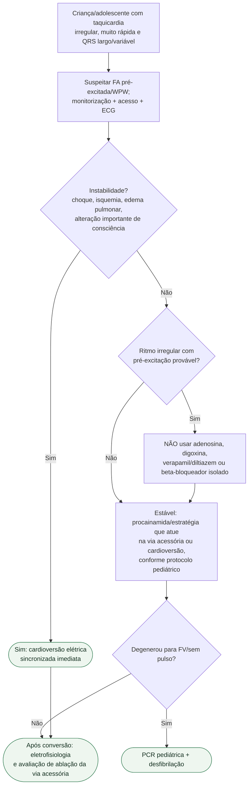

# FA pré-excitada/WPW pediátrica

## Regra prática

Adenosina é excelente em algumas TSVs pediátricas, mas **pode ser perigosa na FA pré-excitada**. A irregularidade do ritmo é a pista que muda o algoritmo.