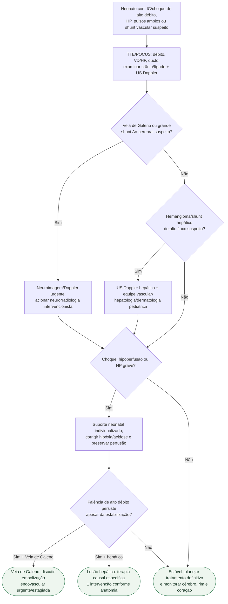

# IC de alto débito neonatal

## Regra prática

No alto débito neonatal, **o coração pode ser vítima de um shunt extracardíaco**. Suporte hemodinâmico compra tempo; o tratamento causal fecha/reduz o circuito de alto fluxo.