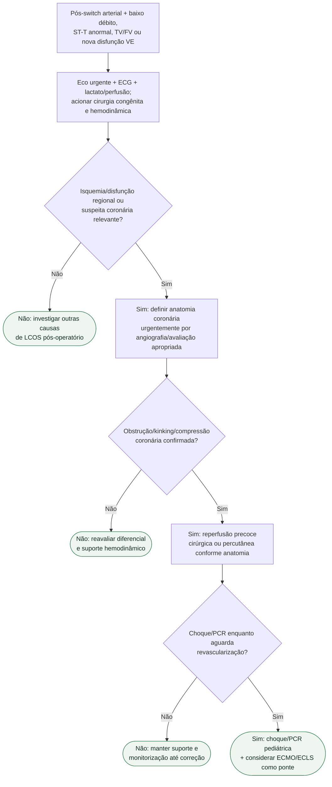

# Isquemia após switch arterial

```mermaid
flowchart TD
  R0["Pós-switch arterial + baixo débito,<br/>ST-T anormal, TV/FV ou nova disfunção VE"]
  P1["Eco urgente + ECG + lactato/perfusão;<br/>acionar cirurgia congênita e hemodinâmica"]
  D1{"Isquemia/disfunção regional ou<br/>suspeita coronária relevante?"}
  C1(["Não: investigar outras causas<br/>de LCOS pós-operatório"])
  P2["Sim: definir anatomia coronária<br/>urgentemente por angiografia/avaliação apropriada"]
  D2{"Obstrução/kinking/compressão<br/>coronária confirmada?"}
  C2(["Não: reavaliar diferencial<br/>e suporte hemodinâmico"])
  P3["Sim: reperfusão precoce<br/>cirúrgica ou percutânea conforme anatomia"]
  D3{"Choque/PCR enquanto aguarda<br/>revascularização?"}
  C3(["Não: manter suporte e<br/>monitorização até correção"])
  C4(["Sim: choque/PCR pediátrica<br/>+ considerar ECMO/ECLS como ponte"])

  R0 --> P1
  P1 --> D1
  D1 -->|"Não"| C1
  D1 -->|"Sim"| P2
  P2 --> D2
  D2 -->|"Não"| C2
  D2 -->|"Sim"| P3
  P3 --> D3
  D3 -->|"Não"| C3
  D3 -->|"Sim"| C4

  classDef conduta fill:#eef6ef,stroke:#2f7a4f,color:#12301f;
  class C1,C2,C3,C4 conduta;
```

## Regra prática

No switch arterial, **baixo débito inexplicado não deve ser tratado por horas sem excluir insuficiência coronária**.