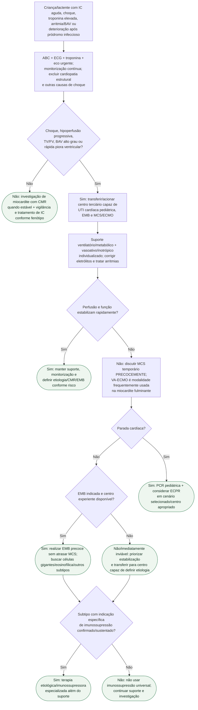

# Miocardite fulminante pediátrica

## Regra prática

Na criança em rápida deterioração, **CMR não vem antes da estabilização e a discussão de ECMO não deve esperar falência multiorgânica**. A etiologia é refinada em paralelo, com EMB precoce nos casos de alto risco em centro experiente.
