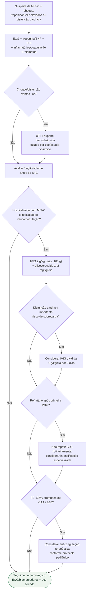

# MIS-C com disfunção miocárdica/choque

## Regra prática

No MIS-C com coração comprometido, **não administre IVIG como se a função ventricular fosse normal**: primeiro defina o volume e a função, depois imunomodulação e antitrombose.