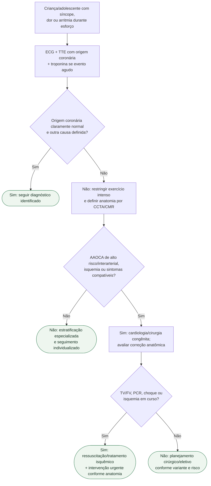

# AAOCA com sintomas de esforço

```mermaid
flowchart TD
  R0["Criança/adolescente com síncope,<br/>dor ou arritmia durante esforço"]
  P1["ECG + TTE com origem coronária<br/>+ troponina se evento agudo"]
  D1{"Origem coronária claramente normal<br/>e outra causa definida?"}
  C1(["Sim: seguir diagnóstico identificado"])
  P2["Não: restringir exercício intenso<br/>e definir anatomia por CCTA/CMR"]
  D2{"AAOCA de alto risco/interarterial,<br/>isquemia ou sintomas compatíveis?"}
  C2(["Não: estratificação especializada<br/>e seguimento individualizado"])
  P3["Sim: cardiologia/cirurgia congênita;<br/>avaliar correção anatômica"]
  D3{"TV/FV, PCR, choque ou<br/>isquemia em curso?"}
  C3(["Sim: ressuscitação/tratamento isquêmico<br/>+ intervenção urgente conforme anatomia"])
  C4(["Não: planejamento cirúrgico/eletivo<br/>conforme variante e risco"])

  R0 --> P1
  P1 --> D1
  D1 -->|"Sim"| C1
  D1 -->|"Não"| P2
  P2 --> D2
  D2 -->|"Não"| C2
  D2 -->|"Sim"| P3
  P3 --> D3
  D3 -->|"Sim"| C3
  D3 -->|"Não"| C4

  classDef conduta fill:#eef6ef,stroke:#2f7a4f,color:#12301f;
  class C1,C2,C3,C4 conduta;
```

## Regra prática

**Teste funcional negativo não substitui anatomia normal.** Em síncope de esforço, primeiro confirme de onde saem e por onde passam as coronárias.