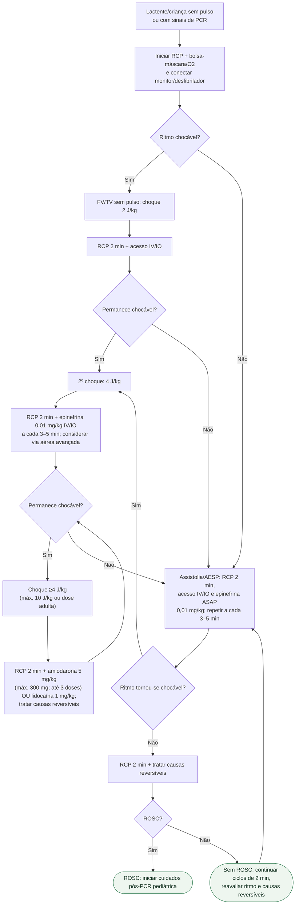

# Parada cardiorrespiratória pediátrica

## RCP de alta qualidade

- 100–120 compressões/min.
- Profundidade ≥1/3 do diâmetro anteroposterior do tórax.
- Retorno completo e interrupções mínimas.
- Trocar compressor a cada 2 minutos ou antes se houver fadiga.
- Com via aérea avançada: compressões contínuas e 1 ventilação a cada 2–3 segundos.

## Causas reversíveis

Hipovolemia, hipóxia, acidose, hipoglicemia, hipo/hipercalemia, hipotermia, pneumotórax hipertensivo, tamponamento cardíaco, toxinas, trombose pulmonar e trombose coronariana.
