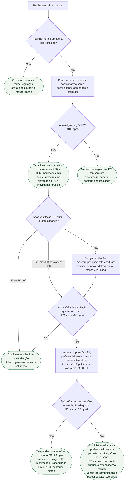

# Reanimação neonatal na sala de parto

## Ponto de segurança

No recém-nascido, **compressão sem ventilação eficaz é um erro de sequência**. A diretriz AHA/AAP 2025 mantém ventilação como intervenção prioritária e recomenda iniciar compressões somente quando a FC segue <60 bpm apesar de ventilação que efetivamente infla os pulmões.
