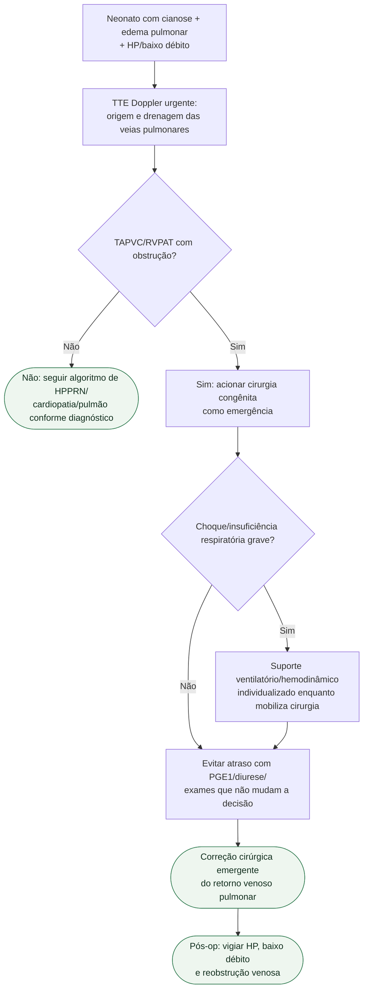

# TAPVC obstruído neonatal

```mermaid
flowchart TD
  R0["Neonato com cianose + edema pulmonar<br/>+ HP/baixo débito"]
  P1["TTE Doppler urgente:<br/>origem e drenagem das veias pulmonares"]
  D1{"TAPVC/RVPAT com obstrução?"}
  C1(["Não: seguir algoritmo de HPPRN/<br/>cardiopatia/pulmão conforme diagnóstico"])
  P2["Sim: acionar cirurgia congênita<br/>como emergência"]
  D2{"Choque/insuficiência respiratória grave?"}
  P3["Suporte ventilatório/hemodinâmico<br/>individualizado enquanto mobiliza cirurgia"]
  P4["Evitar atraso com PGE1/diurese/<br/>exames que não mudam a decisão"]
  C2(["Correção cirúrgica emergente<br/>do retorno venoso pulmonar"])
  C3(["Pós-op: vigiar HP, baixo débito<br/>e reobstrução venosa"])

  R0 --> P1
  P1 --> D1
  D1 -->|"Não"| C1
  D1 -->|"Sim"| P2
  P2 --> D2
  D2 -->|"Sim"| P3
  D2 -->|"Não"| P4
  P3 --> P4
  P4 --> C2
  C2 --> C3

  classDef conduta fill:#eef6ef,stroke:#2f7a4f,color:#12301f;
  class C1,C2,C3 conduta;
```

## Regra prática

TAPVC obstruído é uma das cardiopatias neonatais em que **"estabilizar antes de operar" pode virar atraso perigoso**.