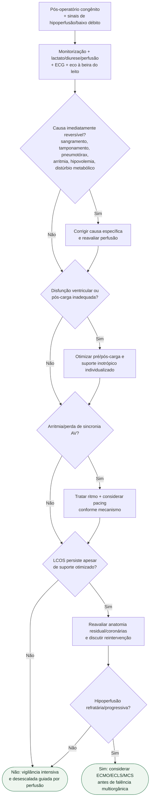

# LCOS após cirurgia congênita

```mermaid
flowchart TD
  R0["Pós-operatório congênito<br/>+ sinais de hipoperfusão/baixo débito"]
  P1["Monitorização + lactato/diurese/perfusão<br/>+ ECG + eco à beira do leito"]
  D1{"Causa imediatamente reversível?<br/>sangramento, tamponamento, pneumotórax,<br/>arritmia, hipovolemia, distúrbio metabólico"}
  P2["Corrigir causa específica<br/>e reavaliar perfusão"]
  D2{"Disfunção ventricular ou<br/>pós-carga inadequada?"}
  P3["Otimizar pré/pós-carga e<br/>suporte inotrópico individualizado"]
  D3{"Arritmia/perda de sincronia AV?"}
  P4["Tratar ritmo + considerar pacing<br/>conforme mecanismo"]
  D4{"LCOS persiste apesar<br/>de suporte otimizado?"}
  P5["Reavaliar anatomia residual/coronárias<br/>e discutir reintervenção"]
  D5{"Hipoperfusão refratária/progressiva?"}
  C1(["Não: vigilância intensiva<br/>e desescalada guiada por perfusão"])
  C2(["Sim: considerar ECMO/ECLS/MCS<br/>antes de falência multiorgânica"])

  R0 --> P1
  P1 --> D1
  D1 -->|"Sim"| P2
  D1 -->|"Não"| D2
  P2 --> D2
  D2 -->|"Sim"| P3
  D2 -->|"Não"| D3
  P3 --> D3
  D3 -->|"Sim"| P4
  D3 -->|"Não"| D4
  P4 --> D4
  D4 -->|"Sim"| P5
  D4 -->|"Não"| C1
  P5 --> D5
  D5 -->|"Não"| C1
  D5 -->|"Sim"| C2

  classDef conduta fill:#eef6ef,stroke:#2f7a4f,color:#12301f;
  class C1,C2 conduta;
```

## Regra prática

No LCOS, **a resposta não é automaticamente “mais inotrópico”**. Ritmo, anatomia residual, pré-carga e VD precisam ser reavaliados em paralelo.