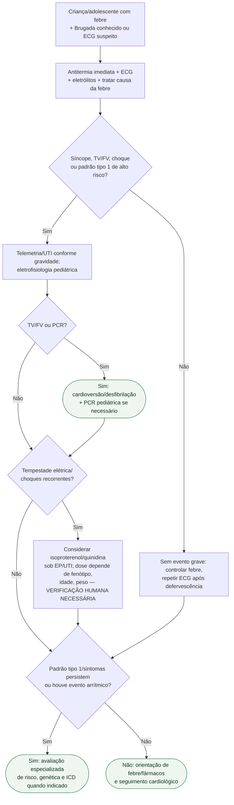

# Brugada + febre

## Regra prática

**Na criança com Brugada, febre é parte da arritmia.** Trate a temperatura como gatilho elétrico e monitore o coração enquanto trata a infecção.

Em tempestade elétrica associada ao padrão de Brugada, tratar imediatamente febre, distúrbios eletrolíticos e fatores precipitantes, realizar desfibrilação quando indicada e acionar eletrofisiologia pediátrica/UTI. Isoproterenol e quinidina podem ser considerados sob supervisão especializada, cada um com lastro pediátrico próprio — não é uma lacuna total de informação —, mas **não há registro de uso conjunto e simultâneo das duas drogas em criança/adolescente nas fontes consultadas**: a quinidina/quinina tem relatos de caso isolados de sucesso (ver `source_refs`); o isoproterenol é recomendado por consenso pediátrico especializado (Peltenburg et al. 2022), não por relato de desfecho individual. O mesmo consenso alerta que, em criança com variante de SCN5A de fenótipo rate/use-dependente, isoproterenol pode ser problemático — considerar substituir por betabloqueador se a taquicardia associar elevação de ST ou aumento de PR/QRS. Não existe posologia pediátrica robustamente validada por diretriz graduada para nenhuma das duas drogas — este fluxograma não fixa uma dose única de propósito.