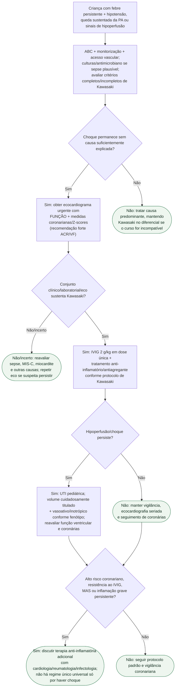

# Síndrome do choque da doença de Kawasaki

## Ponto-chave

Em choque febril inexplicado, o ecocardiograma precisa incluir **coronárias**, não apenas função ventricular. Se Kawasaki estiver sustentada, IVIG 2 g/kg é tratamento de primeira linha; vasoativo e imunomodulação adicional dependem do fenótipo clínico e do risco.
