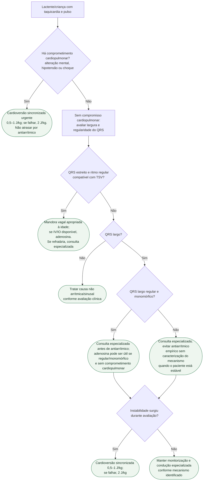

# Taquiarritmia pediátrica com pulso

## Regra de segurança

Na presença de comprometimento cardiopulmonar, a cardioversão sincronizada é prioritária **independentemente de o mecanismo ser supraventricular ou ventricular**. A diretriz AHA/AAP 2025 recomenda 0,5–1 J/kg inicialmente, escalando para 2 J/kg se necessário.

## Tudo com Tudo

- [Protocolo de taquiarritmia pediátrica com pulso](taquiarritmia-pediatrica-com-pulso-aha-aap-2025.md)
- [Taquicardia supraventricular no lactente e na criança](taquicardia-supraventricular-no-lactente-e-na-crianca-manejo-agudo-e-cronico.md)
- [Fluxograma de fibrilação atrial pré-excitada/WPW](fluxograma-fibrilacao-atrial-pre-excitada-wpw-na-crianca-e-adolescente.md)
- [Fluxograma de taquicardia juncional ectópica pós-operatória](fluxograma-taquicardia-juncional-ectopica-pos-operatoria-jet.md)
- [Taquicardia ventricular idiopática na criança e no adolescente](taquicardia-ventricular-idiopatica-na-crianca-e-no-adolescente-diagnostico-diferencial-manobras-e-decisao-de-tratar.md)
