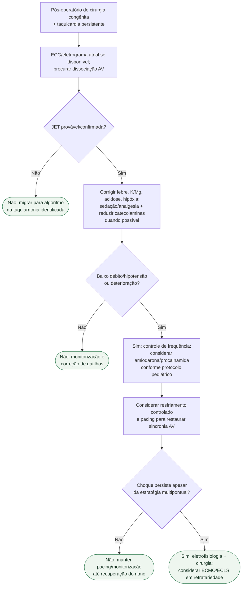

# JET pós-operatória pediátrica

## Regra prática

JET pós-operatória é frequentemente uma arritmia de **baixo débito por perda de sincronia AV**. Corrigir a fisiologia e reduzir a frequência pode ser mais importante, inicialmente, do que perseguir conversão elétrica repetida.