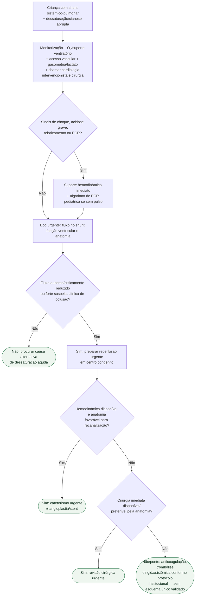

# Trombose aguda de shunt sistêmico-pulmonar

## Regra prática

Em criança com shunt sistêmico-pulmonar, **dessaturação abrupta é obstrução do shunt até prova em contrário** quando o contexto clínico é compatível. O objetivo é ganhar tempo apenas o suficiente para estabilizar e restaurar fluxo — não substituir reperfusão por suporte inespecífico.

**Tromboprofilaxia (prevenção) não é o mesmo problema que trombólise (tratamento da oclusão já instalada).** O CHEST 2012 (Monagle et al., PMID 22315277) tem recomendação específica só para a primeira: heparina não fracionada intraoperatória e, no pós-operatório, aspirina ou nenhuma terapia antitrombótica (ambas Grau 2C, evidência fraca). Para o cenário deste fluxograma — shunt já ocluído, em emergência — a diretriz não define esquema de trombólise; a decisão de reperfusão (cirúrgica, percutânea ou farmacológica) é institucional, não um protocolo publicado único.
