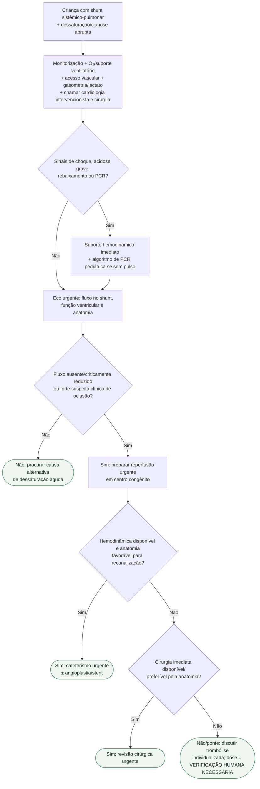

# Trombose aguda de shunt sistêmico-pulmonar

## Regra prática

Em criança com shunt sistêmico-pulmonar, **dessaturação abrupta é obstrução do shunt até prova em contrário** quando o contexto clínico é compatível. O objetivo é ganhar tempo apenas o suficiente para estabilizar e restaurar fluxo — não substituir reperfusão por suporte inespecífico.