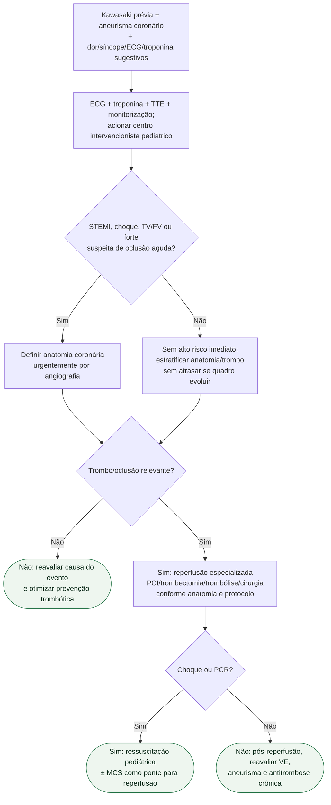

# Trombose coronária/infarto em Kawasaki

> As modalidades abaixo não formam uma hierarquia universal. Não transformar a listagem em escolha automática de tratamento nem importar doses gerais de anticoagulação/trombólise para este cenário raro.

## Regra prática

Aneurisma de Kawasaki não é apenas um problema de seguimento: **pode trombosar e causar IAM pediátrico verdadeiro**.
