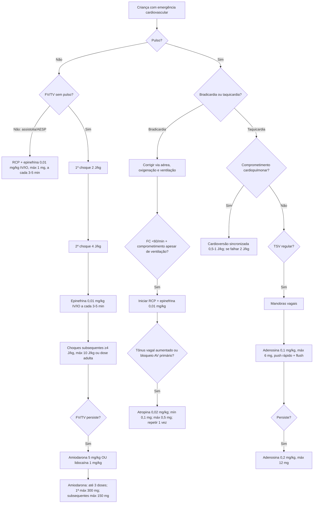

# PALS 2025 — doses de emergência e árvore de decisão

As recomendações PALS 2025 se aplicam a lactentes e crianças até 18 anos, **excluindo recém-nascidos**, que seguem o algoritmo de reanimação neonatal.

## PCR pediátrica

### Epinefrina
- 0,01 mg/kg IV/IO na concentração 0,1 mg/mL.
- Máximo 1 mg por dose.
- Repetir a cada 3–5 minutos durante a PCR.

### Amiodarona em FV/TV sem pulso refratária
- 5 mg/kg IV/IO em bolus.
- Pode repetir até 3 doses.
- Primeira dose: máximo 300 mg.
- Doses subsequentes: máximo 150 mg cada.

### Lidocaína
- 1 mg/kg IV/IO como alternativa à amiodarona para FV/TV sem pulso refratária.

### Desfibrilação
- 1º choque: 2 J/kg.
- 2º choque: 4 J/kg.
- Choques subsequentes: ≥4 J/kg.
- Máximo: 10 J/kg ou dose de adulto.

## Bradicardia com pulso

A prioridade é corrigir hipóxia e ventilação inadequada. Se a frequência permanece <60/min com comprometimento cardiopulmonar apesar de ventilação adequada, o PALS direciona para RCP e epinefrina.

**Atropina** é reservada para bradicardia associada a aumento de tônus vagal ou bloqueio AV primário:
- 0,02 mg/kg IV/IO;
- mínimo 0,1 mg;
- máximo por dose 0,5 mg;
- pode repetir uma vez.

Importante: o mínimo de 0,1 mg pertence ao algoritmo de **bradicardia**. A AHA/AAP 2025 diferencia esse contexto da atropina como pré-medicação para intubação, na qual não estabelece dose mínima.

## TSV pediátrica

- 1ª adenosina: 0,1 mg/kg, máximo 6 mg, push IV/IO rápido seguido de flush.
- 2ª adenosina: 0,2 mg/kg, máximo 12 mg.
- Cardioversão sincronizada se comprometimento cardiopulmonar: 0,5–1 J/kg inicialmente; se ineficaz, 2 J/kg.
- Em QRS largo estável, adenosina só deve ser considerada se o ritmo for regular e monomórfico e com apoio especializado.

## Referência

Lasa JJ, Dhillon GS, Duff JP, et al. *Part 8: Pediatric Advanced Life Support: 2025 American Heart Association Guidelines for Cardiopulmonary Resuscitation and Emergency Cardiovascular Care*. Circulation. 2025;152(Suppl 2):S479-S537. DOI: **10.1161/CIR.0000000000001368**.
