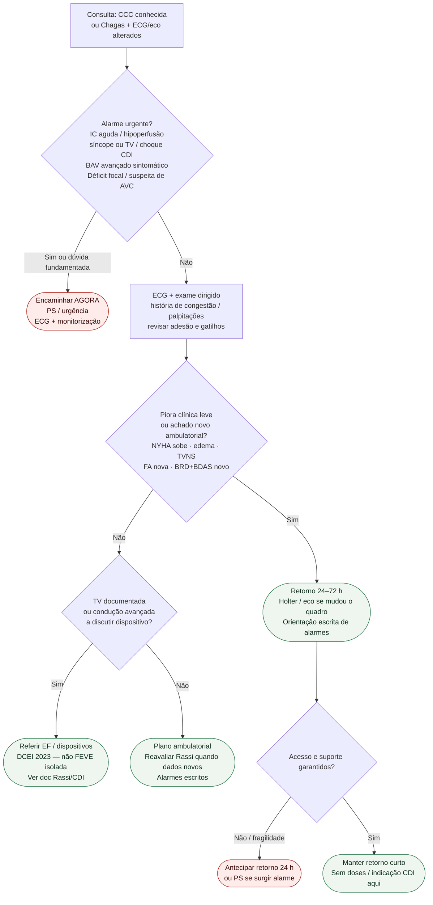

# Fluxograma ambulatorial: cardiomiopatia chagásica — destino

Prosa: [`sinalizadores-ambulatoriais-cardiomiopatia-chagasica-quando-escalar`](sinalizadores-ambulatoriais-cardiomiopatia-chagasica-quando-escalar.md). Forma indeterminada: [`chagas-ambulatorial-forma-indeterminada-quando-escalar-avaliacao`](chagas-ambulatorial-forma-indeterminada-quando-escalar-avaliacao.md). CDI/Rassi: [`cardiopatia-chagasica-cronica-escore-de-rassi-e-indicacao-de-cdi`](../Dispositivos/cardiopatia-chagasica-cronica-escore-de-rassi-e-indicacao-de-cdi.md).

## Árvore de decisão

## Notas

- **D1** = gate de segurança (IC, arritmia, condução, embolia).
- **D2** = braço ambulatorial de piora — Holter/eco e retorno curto, não “eletivo distante”.
- **D3** = ponte para DCEI 2023 (TV documentada), sem reabrir a Tabela 23 neste fluxograma.
- **D4** = segurança do plano (acesso/fragilidade).
- Forma indeterminada sem CCC estabelecida: documento-irmão dedicado.
