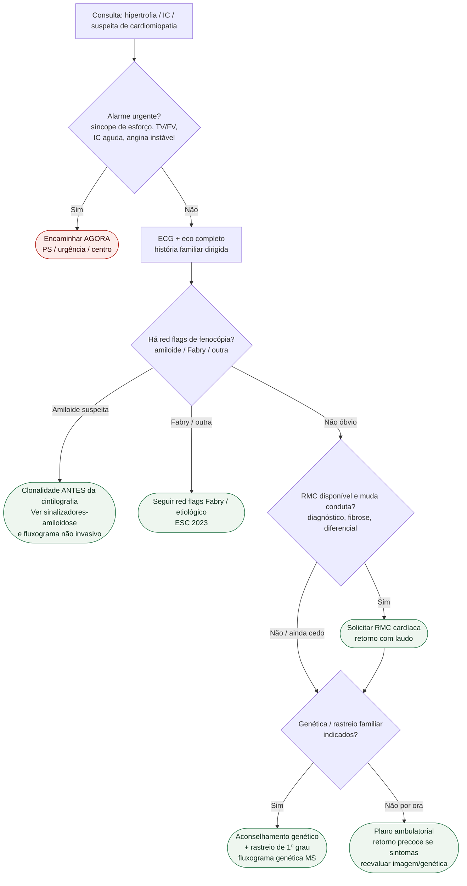

# Fluxograma ambulatorial: cardiomiopatia — quando escalar imagem e genética

Prosa: [`sinalizadores-ambulatoriais-de-cardiomiopatia-hipertrofica-quando-encaminhar`](sinalizadores-ambulatoriais-de-cardiomiopatia-hipertrofica-quando-encaminhar.md) e [`sinalizadores-ambulatoriais-de-suspeita-de-amiloidose-cardiaca`](sinalizadores-ambulatoriais-de-suspeita-de-amiloidose-cardiaca.md).

Não substitui [`fluxograma-cardiomiopatia-hipertrofica-esc-2023`](fluxograma-cardiomiopatia-hipertrofica-esc-2023.md), [`fluxograma-amiloidose-cardiaca-diagnostico-nao-invasivo`](fluxograma-amiloidose-cardiaca-diagnostico-nao-invasivo.md) nem [`fluxograma-investigacao-genetica-cardiomiopatia-historia-familiar-morte-subita`](fluxograma-investigacao-genetica-cardiomiopatia-historia-familiar-morte-subita.md).

## Árvore de decisão

## Notas

- **D1** = gate de segurança ambulatorial (não negociável).
- **D2** = fenocópia antes de rotular “HCM sarcomérica”.
- **C2** = ordem diagnóstica da amiloide (clonalidade → cintilografia).
- **D4** = genética com aconselhamento, não “pedido solto”.
- Hub arritmogênica / sarcoidose: fora deste PR (anti-colisão com PRs abertos).
