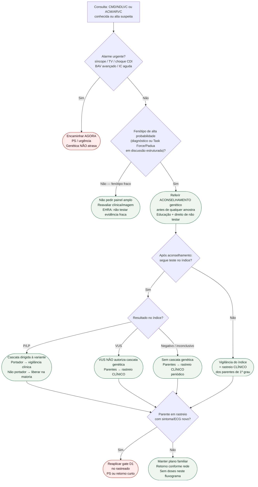

# Fluxograma ambulatorial: CMD e ACM — genética e rastreio familiar

Prosa: [`sinalizadores-ambulatoriais-dcm-quando-referir-aconselhamento-genetico`](sinalizadores-ambulatoriais-dcm-quando-referir-aconselhamento-genetico.md) e [`sinalizadores-ambulatoriais-acm-arvc-rastreamento-familiar-quando-escalar`](sinalizadores-ambulatoriais-acm-arvc-rastreamento-familiar-quando-escalar.md).

Não substitui [`fluxograma-investigacao-genetica-cardiomiopatia-historia-familiar-morte-subita`](fluxograma-investigacao-genetica-cardiomiopatia-historia-familiar-morte-subita.md) (árvore EHRA completa, já revisada).

## Árvore de decisão

## Notas

- **D1** = gate de segurança (não negociável).
- **D2/C3** = aconselhamento **antes** do teste (EHRA 2022 / ESC 2023).
- **D4** = três destinos familiares distintos (P/LP vs. VUS vs. negativo).
- **D5** = o rastreado vira paciente se sintoma/ECG mudar.
- HCM/amiloide ambulatory: #844. Chagas: #862. PPCM/gestação: #849 (outra pasta).
