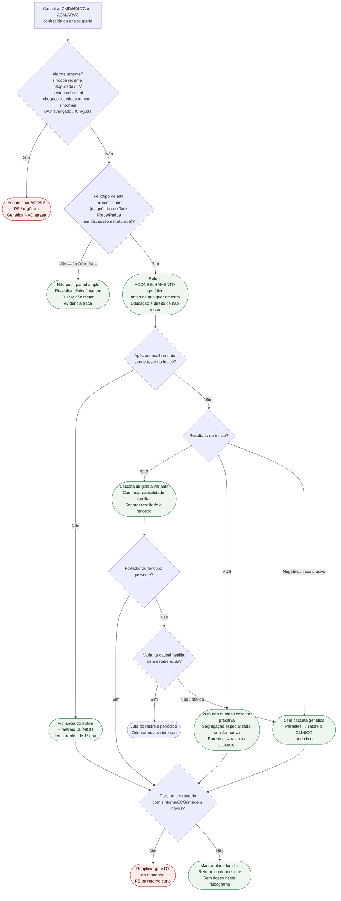

# Fluxograma ambulatorial: CMD e ACM — genética e rastreio familiar

Prosa: [sinalizadores-ambulatoriais-dcm-quando-referir-aconselhamento-genetico](/biblioteca/sinalizadores-ambulatoriais-dcm-quando-referir-aconselhamento-genetico) e [sinalizadores-ambulatoriais-acm-arvc-rastreamento-familiar-quando-escalar](/biblioteca/sinalizadores-ambulatoriais-acm-arvc-rastreamento-familiar-quando-escalar).

Não substitui [fluxograma-investigacao-genetica-cardiomiopatia-historia-familiar-morte-subita](/biblioteca/fluxograma-investigacao-genetica-cardiomiopatia-historia-familiar-morte-subita) (árvore EHRA completa, já revisada).

## Árvore de decisão

## Notas

- **D1** = gate de segurança (não negociável).
- **D2/C3** = aconselhamento **antes** do teste (EHRA 2022 / ESC 2023).
- **D4** = três destinos familiares distintos (P/LP vs. VUS vs. negativo).
- **D5** = o rastreado vira paciente se sintoma/ECG mudar.
- Cardiomiopatia hipertrófica, amiloidose, Chagas e cardiomiopatia periparto têm investigação etiológica e acompanhamento específicos.

## Segurança do seguimento familiar

P/LP significa patogênica/provavelmente patogênica e exige interpretação compatível com gene, mecanismo e fenótipo familiar. VUS não confirma diagnóstico nem libera parentes; análise de segregação em familiares afetados ou informativos pode ajudar na reclassificação sob equipe especializada. Teste negativo no índice não exclui origem hereditária.

Alteração nova de imagem, mesmo sem sintomas ou mudança de ECG, exige avaliação breve em cardiomiopatias. Na ACM, incluir monitorização ambulatorial de ECG também em parentes assintomáticos. Evento remoto já avaliado, mantendo estabilidade, segue revisão ambulatorial de risco; choque único com recuperação completa pede contato urgente com clínica de dispositivos, enquanto choques repetidos, síncope ou instabilidade pedem emergência.
