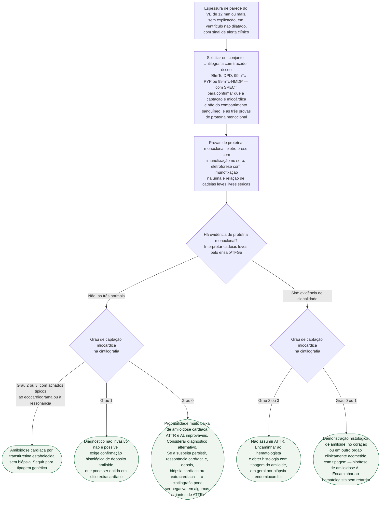
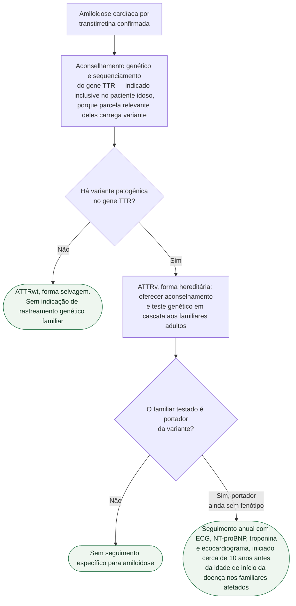

# Fluxograma: Amiloidose cardíaca — algoritmo diagnóstico não invasivo e tipagem genética

O algoritmo não invasivo mudou a amiloidose cardíaca de diagnóstico de exceção,
que dependia de biópsia, para diagnóstico alcançável no consultório. Mas ele tem
uma regra de leitura que, invertida, produz o erro mais grave possível nesta
doença: **tratar uma amiloidose AL como se fosse ATTR**.

A regra é esta. A cintilografia com traçador ósseo positiva **não prova ATTR
sozinha** — captação miocárdica grau 2 ou 3 aparece em mais de 10% dos pacientes
com amiloidose de cadeia leve. Por isso a pesquisa de proteína monoclonal não é
exame complementar: ela é **condição de validade** da cintilografia. Se qualquer
uma das três provas indicar clonalidade após interpretação do ensaio e da função renal, a cintilografia deixa de
poder estabelecer o diagnóstico, por mais intensa que seja a captação.

Os dois exames são pedidos juntos. É a leitura que é hierárquica.

## Quando levantar a suspeita

O gatilho estrutural é **espessura de parede do ventrículo esquerdo de 12 mm ou
mais, sem explicação**, em ventrículo não dilatado. Esse achado em idoso com
insuficiência cardíaca de fração de ejeção preservada, com diagnóstico de
cardiomiopatia hipertrófica ou com estenose aórtica grave — sobretudo o candidato
a TAVI — deve disparar a investigação: **a ATTR foi encontrada em até 7 a 19%
dos pacientes nesses cenários**.

Somam-se a isso os sinais de alerta:

| Cardíacos | Extracardíacos |
|---|---|
| baixa voltagem do QRS desproporcional à espessura de parede; padrão de pseudoinfarto ao ECG; distúrbio de condução atrioventricular; hipotensão; NT-proBNP desproporcionalmente elevado; elevação persistente de troponina; aspecto granular brilhante ao ecocardiograma; derrame pericárdico | síndrome do túnel do carpo bilateral; ruptura do tendão do bíceps; estenose de canal lombar; polineuropatia; disautonomia; equimoses cutâneas; macroglossia; depósitos vítreos; insuficiência renal e proteinúria; história familiar |

## Árvore de decisão: diagnóstico

## Árvore de decisão: tipagem genética e rastreamento familiar

## A graduação de Perugini, que decide o nó `D2`

| Grau | Captação | Leitura |
|---|---|---|
| 0 | ausência de captação miocárdica, captação óssea normal | negativa |
| 1 | captação miocárdica menor que a óssea | insuficiente para diagnóstico não invasivo |
| 2 | captação miocárdica semelhante à óssea | positiva |
| 3 | captação miocárdica maior que a óssea, com captação óssea reduzida ou ausente | positiva |

O **SPECT é obrigatório**, não opcional: sem ele não se distingue captação do
miocárdio de captação do sangue nas câmaras, e o grau atribuído pode ser o de
outra estrutura.

## Os valores de referência da relação de cadeias leves livres

A relação kappa/lambda é o ponto em que o algoritmo mais escorrega, porque o
valor normal **depende do ensaio e da função renal**:

| Situação | Faixa considerada normal |
|---|---|
| Ensaio Freelite | 0,26 a 1,65 |
| Ensaio N Latex | 0,53 a 1,51 |
| Ensaio Freelite, DRC com TFGe <45, imunofixações sérica e urinária normais | até 2,0 |
| Ensaio Freelite, paciente em diálise, com imunofixações normais | até 3,1 |

Ler a relação de um paciente renal crônico pela faixa do paciente com função
renal normal produz uma clonalidade que não existe — e joga para a biópsia um
paciente que teria diagnóstico não invasivo.

## O que as árvores não mostram

**Tratamento modificador da doença vale para os dois genótipos**, ATTRv e ATTRwt,
e por isso saiu do diagrama. O position statement coloca o **tafamidis como agente
de escolha na ATTR cardíaca**, e recomenda que seja considerado no paciente com
expectativa de sobrevida razoável. O ensaio pivotal é o **ATTR-ACT**: 441
pacientes, mortalidade por qualquer causa de 29,5% com tafamidis contra 42,9%
com placebo em 30 meses, e redução das hospitalizações cardiovasculares de 0,70
para 0,48 evento por ano. Os silenciadores gênicos **patisirana** e **inotersena**
e o **transplante hepático** são as outras opções nomeadas para a forma hereditária.

**Este documento é de diagnóstico, não de tratamento da insuficiência cardíaca
que acompanha a doença.** O manejo volumétrico, o cuidado com betabloqueador e
com inibidor do sistema renina-angiotensina no coração restritivo, e a conduta
diante de arritmia e de distúrbio de condução seguem recomendações próprias.

**O prognóstico da ATTR melhorou** nos últimos anos, e a própria diretriz atribui
isso à combinação de diagnóstico mais precoce, seguimento estruturado e terapia
específica — os três, não apenas o fármaco.

**Estenose aórtica grave e amiloidose coexistem com frequência que não é
anedótica.** Investigar antes do TAVI muda a expectativa de benefício do
procedimento, e é um dos cenários em que a diretriz explicitamente manda procurar.

As faixas renais acima pertencem ao esquema do posicionamento ESC 2021 e não devem ser aplicadas indistintamente ao N Latex ou a qualquer laboratório. Discordância requer hematologia. Espessura ≥12 mm é um sinal de suspeita, não condição obrigatória para investigar AL ou doença precoce. A relação de terapias citada descreve 2021; não é lista exaustiva de opções disponíveis em 2026.

O acompanhamento de portadores de variante deve também considerar avaliação neurológica e oftalmológica, Holter e imagem adicional conforme o protocolo e os sintomas. A periodicidade é orientada por consenso e deve ser individualizada; sintomas compatíveis justificam investigação antes da idade prevista. Teste preditivo de menores assintomáticos não é rotina.

## Tudo com Tudo

- [Diagnóstico e Tratamento da Amiloidose Cardíaca](/biblioteca/diagnostico-e-tratamento-da-amiloidose-cardiaca) — Relaciona o algoritmo não invasivo à narrativa de diagnóstico, exclusão de cadeia leve, tipagem genética e tratamento específico.
