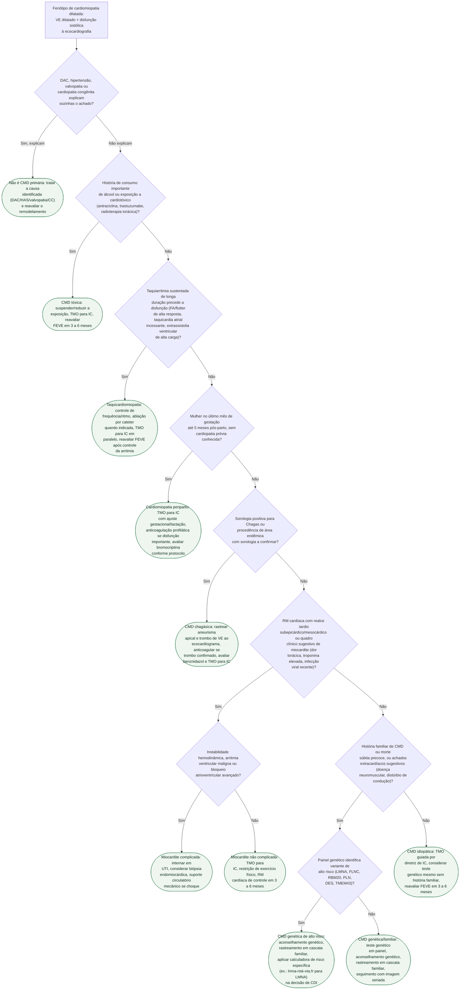

# Fluxograma: Cardiomiopatia dilatada — investigação etiológica sistemática (ESC 2023)

A diretriz ESC 2023 de cardiomiopatias organiza a cardiomiopatia dilatada (CMD)
por **fenótipo primeiro, etiologia depois**: uma vez reconhecido o padrão de
ventrículo esquerdo dilatado com disfunção sistólica, o passo seguinte não é o
teste genético — é **excluir sistematicamente as causas secundárias** (doença
arterial coronariana, hipertensão, valvopatia, cardiopatia congênita) que por
definição afastam o diagnóstico de CMD primária. Só depois dessa exclusão a
investigação percorre, em ordem, as etiologias adquiridas potencialmente
reversíveis — tóxica, taquicardia-induzida, periparto, chagásica, inflamatória —
antes de chegar à hipótese genética/familiar ou à CMD idiopática. Esta árvore
formaliza esse percurso, sem repetir o que os documentos de diagnóstico
genético e estratificação de risco de morte súbita desta mesma pasta já cobrem
em profundidade.

## Árvore de decisão

## Por que esta ordem, e o que fica de fora do diagrama

A sequência de exclusão segue a lógica da própria definição da ESC 2023: CMD é
dilatação e disfunção sistólica **não explicadas por** sobrecarga hemodinâmica
ou DAC — logo, excluir essas causas é o primeiro passo, não um item entre
outros. As etiologias adquiridas potencialmente **reversíveis** (tóxica,
taquicardia-induzida, periparto, chagásica com trombo tratável, miocardítica)
vêm antes da investigação genética porque mudam o prognóstico e a urgência da
conduta de forma mais imediata do que a etiologia genética — e porque
identificar uma causa reversível não impede, em paralelo, considerar teste
genético quando a suspeita clínica também apontar nessa direção (ver o ramo
final, CMD idiopática).

**Não entram como ramos da árvore, por valerem transversalmente a qualquer
etiologia identificada:** o rastreamento familiar em cascata (recomendado em
toda cardiomiopatia hereditária ou suspeita de ser, independentemente de o
teste genético estar em curso), o aconselhamento genético estruturado antes de
qualquer teste, e a reavaliação periódica de FEVE — todos citados dentro dos
nós de conduta correspondentes, mas não desenhados como decisão própria para
não inflar a árvore com passos que não bifurcam a conduta.

A cardiomiopatia chagásica, uma vez confirmada, tem uma armadilha específica já
documentada nesta pasta: o aneurisma apical **não é**, isoladamente, o
preditor mais forte de AVC cardioembólico — **63,3%** do seu efeito é mediado
pelo trombo de ventrículo esquerdo que ele favorece formar, não por mecanismo
direto independente. Por isso o nó de conduta desta árvore para CMD chagásica
especifica rastrear **trombo**, não apenas registrar a presença do aneurisma.

A estratificação de risco de morte súbita e a indicação formal de CDI por
fenótipo — incluindo a calculadora de risco específica para portador de
mutação LMNA (índice C de 0,776, limiar de risco em 5 anos ≥7%) — são tratadas
em profundidade no documento "Cardiomiopatia Dilatada (CMD): Diagnóstico
Genético e Manejo (ESC 2023)" desta mesma pasta, e não foram redesenhadas aqui
para evitar duplicar a árvore de decisão.