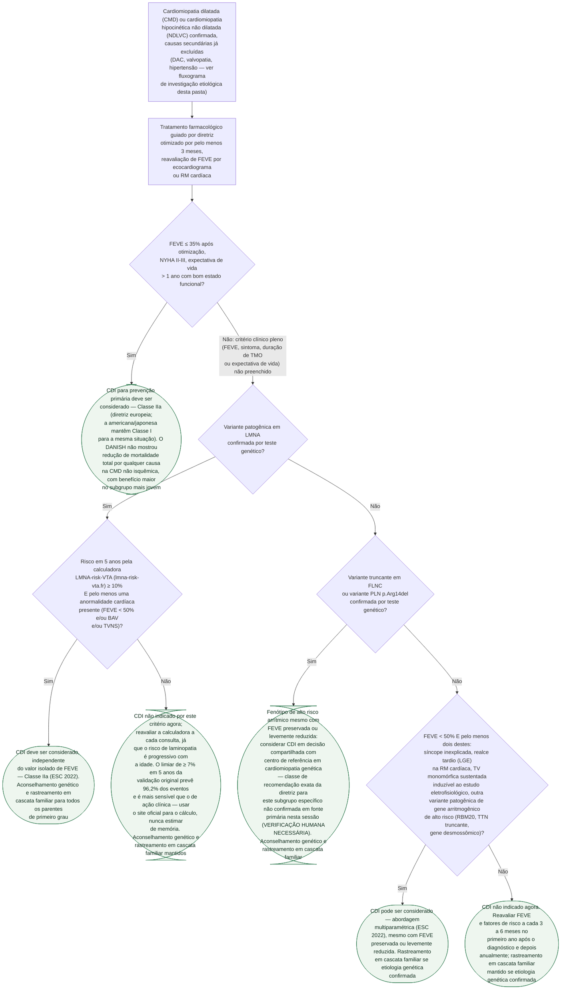

# Fluxograma: Cardiomiopatia dilatada não isquêmica — estratificação de risco de morte súbita e indicação de CDI (ESC 2022)

A diretriz europeia de 2022 sobre arritmias ventriculares e prevenção de morte
súbita organiza a decisão de implantar um cardiodesfibrilador (CDI) na
cardiomiopatia dilatada (CMD) e na cardiomiopatia hipocinética não dilatada
(NDLVC) em torno de um ponto que muda a leitura de qualquer indicação: **a
fração de ejeção isolada deixou de ser o único critério**. Desde o estudo
DANISH, que não mostrou redução de mortalidade total com o CDI na
insuficiência cardíaca de etiologia não isquêmica, a diretriz europeia adota
uma abordagem multiparamétrica — genótipo, realce tardio à ressonância,
síncope inexplicada e indutibilidade ao estudo eletrofisiológico entram na
decisão ao lado da fração de ejeção, sobretudo quando ela está entre 36% e
49%, faixa em que o critério isolado de corte não captura o risco real.

Três pontos que esta árvore fixa, e que mudam conduta:

- **Etiologia isquêmica, valvar e hipertensiva precisam já estar excluídas**
  antes de entrar nesta árvore — é o trabalho do fluxograma de investigação
  etiológica desta mesma pasta, que esta árvore não repete.
- **A CMD não isquêmica tem Classe IIa para CDI de prevenção primária na
  diretriz europeia**, não Classe I — a diretriz americana e a japonesa
  mantêm Classe I para a mesma situação clínica. É uma diferença real entre
  sociedades, não erro de transcrição, e nasce diretamente do resultado do
  DANISH.
- **Variante patogênica em LMNA muda a lógica da decisão**: em vez de esperar
  a fração de ejeção cair a 35%, a diretriz usa uma calculadora de risco
  específica (LMNA-risk-VTA) para antecipar a indicação, porque a
  laminopatia tem um padrão de arritmia grave que pode preceder a
  disfunção sistólica importante.

## Árvore de decisão

## Por que esta ordem, e o que fica de fora do diagrama

A árvore segue a ordem de generalidade decrescente: primeiro o critério que
cobre a maior parte dos pacientes (FEVE ≤ 35% sintomática, o mesmo desenho do
DANISH), depois o gene com calculadora de risco própria e validada (LMNA),
depois os dois genes de alto risco arrítmico reconhecido mas sem calculadora
formal adotada pela diretriz (FLNC truncante, PLN p.Arg14del), e por fim a
abordagem multiparamétrica que reúne o que sobra — síncope, realce tardio,
indutibilidade e outros genes de risco — para quem não se enquadrou em nenhum
critério anterior. **Na prática clínica esses critérios não são avaliados em
sequência estrita**: o teste genético e a ressonância com realce tardio
costumam já estar disponíveis quando a fração de ejeção é reavaliada, e a
diretriz os considera em conjunto, não um de cada vez. A ordem linear aqui é
opção de desenho para caber em árvore de decisão, não reflexo de que a
diretriz process a cada critério isoladamente antes do próximo.

**Dois números de fontes diferentes aparecem lado a lado no nó da calculadora
LMNA-risk-VTA, de propósito.** O artigo original de validação (Wahbi et al.,
2019) relata que um limiar de risco em 5 anos ≥ 7% prevê 96,2% dos eventos
arrítmicos graves na coorte de derivação — é o desempenho estatístico do
próprio escore. Uma revisão de 2026 que cita a diretriz ESC 2022 atribui a
ela um limiar de ação clínica de ≥ 10% (combinado com pelo menos uma
anormalidade cardíaca) para justificar CDI independente da fração de ejeção
isolada. Não escolhemos um dos dois números e descartamos o outro: o
primeiro é a validação do instrumento, o segundo é o corte que a diretriz
teria adotado para agir sobre ele — são perguntas diferentes, e confundir as
duas seria o tipo de erro que este projeto existe para evitar.

**O rastreamento em cascata familiar não é ramo da árvore.** Ele vale
transversalmente a qualquer confirmação de etiologia genética — LMNA, FLNC,
PLN ou outro gene de risco —, por isso está escrito dentro de cada nó de
conduta correspondente, e não desenhado como decisão própria (mesmo padrão
já adotado no fluxograma de investigação etiológica da CMD desta pasta, para
não inflar a árvore com um passo que não bifurca a conduta).

## O que a árvore não mostra, e por quê

**A classe de recomendação exata para FLNC e PLN p.Arg14del ficou marcada
como pendente de verificação, não omitida nem inventada.** As fontes lidas
nesta sessão caracterizam os dois com clareza como genes de alto risco
arrítmico "irrespective of LVEF" (irrespectivo da fração de ejeção) e citam a
existência de um escore de risco dedicado em desenvolvimento para PLN
p.Arg14del, mas nenhuma reproduz a classe/nível exatos que a diretriz ESC
2022 atribui a esse subgrupo especificamente — diferente do que aconteceu
com o critério geral e com o critério LMNA, para os quais uma fonte citou a
classe (IIa) de forma explícita. Escrever "Classe IIa" ou "Classe IIb" ali
por analogia seria inventar um dado que nenhuma fonte lida confirmou.

**Escores emergentes citados nas revisões de 2026 (DCM-SVA, modelo combinado
de LGE e genótipo de Mirelis et al.) não entraram na árvore.** São
ferramentas de pesquisa recente, ainda não formalmente incorporadas ao texto
da diretriz ESC 2022 nas fontes consultadas — incluí-las como critério de
decisão junto dos que a diretriz de fato recomenda misturaria evidência
consolidada com evidência em validação, o que este projeto evita
explicitamente.

**Ressincronização cardíaca (TRC/TRC-D) não entra nesta árvore.** A indicação
de TRC depende de duração e morfologia do QRS, critérios que pertencem a uma
pergunta clínica distinta (dissincronia elétrica, não risco arrítmico
isolado) e que já têm diretriz própria (ESC 2021 de estimulação cardíaca).

**A reavaliação periódica de FEVE após otimização terapêutica é premissa de
toda a árvore, não um ramo dela** — ela está no passo intermediário logo
após a raiz porque toda decisão desta árvore pressupõe que a disfunção
sistólica foi reavaliada depois de pelo menos 3 meses de tratamento guiado
por diretriz, nunca decidida sobre a fração de ejeção do primeiro exame.
