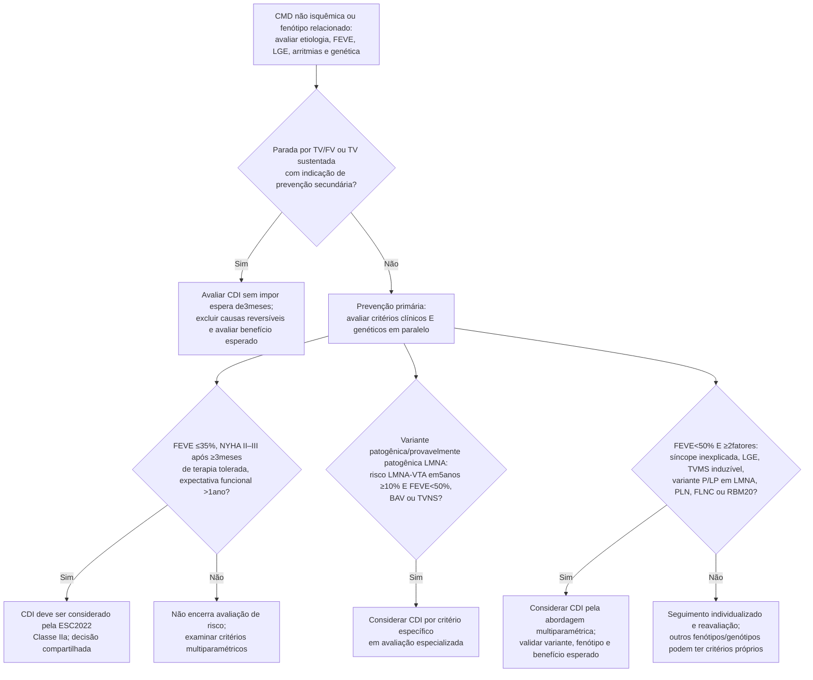

# Fluxograma: Cardiomiopatia dilatada não isquêmica — risco de morte súbita e CDI

A avaliação integra fenótipo, imagem, arritmias, genótipo e expectativa de vida. Condições de carga ou DAC podem coexistir: devem ser avaliadas como explicação suficiente ou contribuição, sem excluir automaticamente cardiomiopatia genética. A ESC2022 usa o termo cardiomiopatia hipocinética não dilatada; NDLVC na ESC2023 é uma categoria fenotípica mais ampla.

## Árvore de decisão

A FEVE<50% é requisito do critério multiparamétrico, não um dos dois fatores. Uma variante TTN truncante ou qualquer gene desmossômico não pode ser acrescentada indistintamente à lista específica da ESC2022. Variantes de significado incerto não equivalem a P/LP. FLNC, PLN e LMNA também podem preencher o critério multiparamétrico: um ramo genético não deve encerrar a investigação dos demais critérios.

## Tempo, prognóstico e decisão compartilhada
O período de otimização antes de reavaliar FEVE se aplica ao critério convencional de prevenção primária; não impõe atraso universal em prevenção secundária ou avaliação de genótipos de alto risco. A expectativa de benefício, comorbidades, preferências e risco de complicações do dispositivo atravessam todos os ramos.

O DANISH foi neutro para mortalidade total na população global, mas reduziu morte súbita; não demonstra inutilidade do CDI em cada paciente. As diferenças entre diretrizes não devem ser atribuídas exclusivamente a um único estudo.

A validação de Wahbi2019 identificou o limiar estatístico ≥7% em cinco anos no modelo LMNA, distinto do limiar de ação ≥10% da ESC2022 combinado com fenótipo cardíaco. Usar a calculadora oficial com entradas corretas; nenhum desses limiares é garantia individual.

## Família e reavaliação
Aconselhamento e rastreamento clínico familiar são necessários conforme o diagnóstico, mesmo se o teste genético do caso índice for negativo. Rastreamento genético em cascata depende de variante causal P/LP; não converter VUS em teste preditivo de doença. Reavaliar após mudanças clínicas e periodicamente em centro experiente. A indicação de ressincronização é examinada em paralelo conforme FEVE, sintomas, ritmo e QRS.

Fontes primárias: Zeppenfeld et al., ESC2022, DOI:10.1093/eurheartj/ehac262, PMID36017572; Wahbi et al., Circulation2019, DOI:10.1161/CIRCULATIONAHA.118.039410, PMID31155932; Køber et al., NEJM2016, DOI:10.1056/NEJMoa1608029, PMID27571011.
