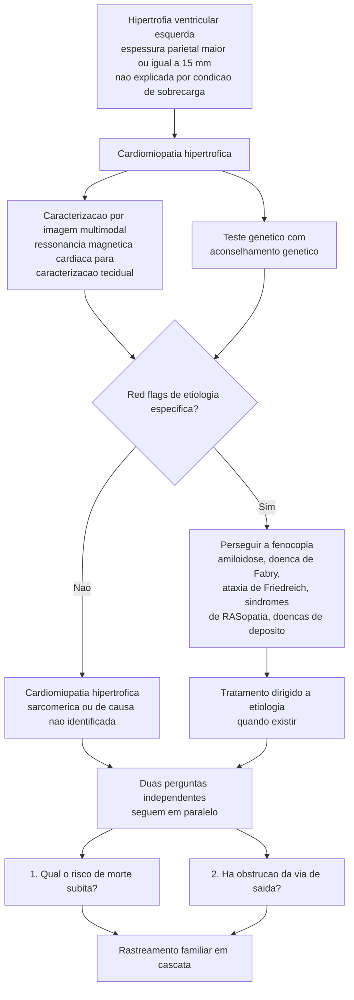
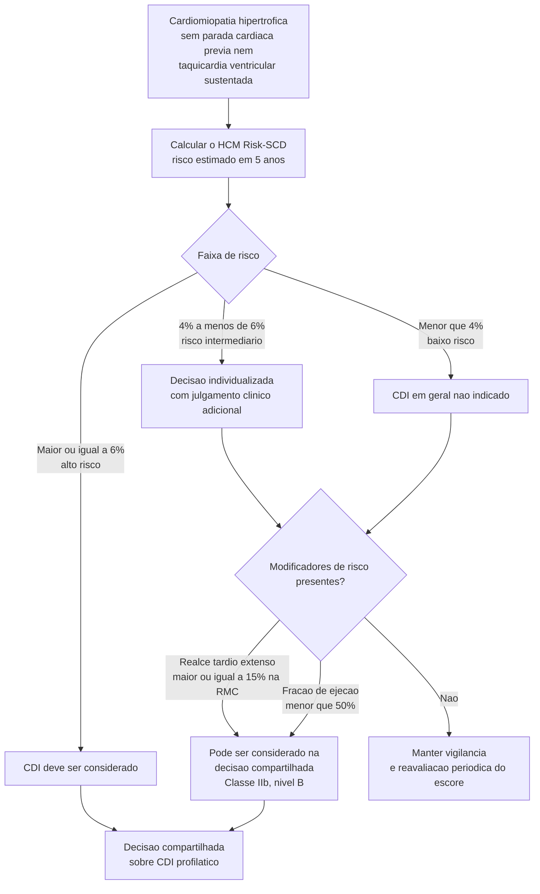
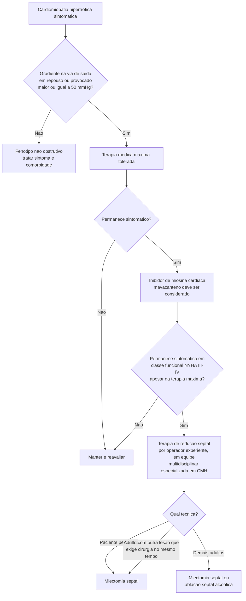

# Fluxograma: Cardiomiopatia hipertrófica (ESC 2023)

A diretriz ESC 2023 de cardiomiopatias trocou a organização por doença
nomeada pela organização **por fenótipo**: primeiro se reconhece o padrão
morfofuncional, depois se persegue a etiologia. Na cardiomiopatia
hipertrófica, isso significa que o achado de hipertrofia não encerra o
raciocínio — abre a busca por *red flags* de fenocópias, que têm tratamento
próprio.

## Do achado de hipertrofia ao diagnóstico

O ponto de corte diagnóstico é **espessura de parede do ventrículo esquerdo
de pelo menos 15 mm**, sem outra causa que explique a hipertrofia. Em
familiares de primeiro grau de caso conhecido, o limiar é menor, porque a
probabilidade pré-teste é outra.

## Estratificação de morte súbita

A diretriz é explícita: **as ferramentas validadas de predição — HCM
Risk-SCD em adultos e HCM Risk-Kids em crianças — são o primeiro passo** da
prevenção de morte súbita, não um complemento opcional. A decisão sobre o
cardioversor-desfibrilador implantável é então discutida e acordada com o
paciente.

As faixas de risco em 5 anos usadas pela ESC são: **baixo, abaixo de 4%;
intermediário, de 4% a 6%; alto, a partir de 6%**. A capacidade
discriminatória do modelo nas recomendações de 2023 foi medida em validação
independente, com área sob a curva de 0,73 (IC 95% 0,68–0,78) para eventos
em 5 anos — bom o bastante para orientar, insuficiente para decidir sozinho,
que é exatamente o motivo dos modificadores.

Os dois modificadores incorporados formalmente à decisão na faixa de risco
baixo são o **realce tardio extenso (≥ 15%) na ressonância** e a **fração de
ejeção abaixo de 50%**, ambos como Classe IIb, nível B. Aneurisma apical,
genética e resposta hipotensiva ao exercício não entraram nessa recomendação
específica.

## Obstrução da via de saída: escala terapêutica

Dois critérios delimitam a indicação de terapia de redução septal, e valem
juntos: **gradiente na via de saída, em repouso ou máximo provocado, de pelo
menos 50 mmHg**, e **classe funcional NYHA/Ross III–IV apesar da terapia
medicamentosa máxima tolerada**.

A escolha entre miectomia e ablação alcoólica não é livre: a **miectomia
septal é recomendada em vez da ablação alcoólica** em pacientes pediátricos
com indicação de redução septal, e em adultos que tenham, além da obstrução,
outra lesão exigindo intervenção cirúrgica no mesmo procedimento.

## O que a diretriz enfatiza como cuidado transversal

Os pilares valem para todas as cardiomiopatias, não só a hipertrófica:
controle de sintomas, identificação e prevenção das complicações da doença —
morte súbita, insuficiência cardíaca e acidente vascular cerebral —,
individualização da prescrição de exercício com avaliação de risco, modelo
de cuidado multidisciplinar e avaliação pré-operatória nos pacientes de alto
risco.
