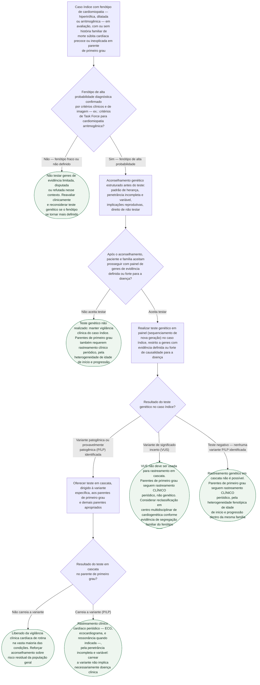

# Fluxograma: Investigação genética na cardiomiopatia com história familiar de morte súbita

O consenso de especialistas EHRA/HRS/APHRS/LAHRS de 2022 organiza a decisão de
testar geneticamente uma cardiomiopatia em duas perguntas que costumam ser
tratadas como uma só, e não são: **quem deve ser testado no caso índice**, e
**o que fazer com cada parente de primeiro grau depois do resultado**. A
segunda pergunta tem três respostas diferentes — variante patogênica
identificada, variante de significado incerto (VUS) e teste negativo —, e
confundir a VUS com um resultado negativo é o erro mais comum descrito pelo
próprio documento: uma VUS **não autoriza** liberar parente algum da vigilância
clínica.

O documento também fecha, de propósito, a porta mais perigosa do teste
genético amplo: testar genes de evidência fraca num fenótipo que não é claro
não esclarece nada e ainda produz variantes de significado incerto que geram
ansiedade e decisões clínicas erradas. Por isso a árvore abaixo começa **antes**
do teste — na qualidade do fenótipo do caso índice — e não na escolha do
painel genético.

## Árvore de decisão

## O sistema de graduação do consenso, e por que ele aparece pouco na árvore

O documento não usa Classe I/IIa/IIb/III nem nível A/B/C — usa um símbolo de
três cores por recomendação: **coração verde** ("deve fazer", apoiado por
evidência observacional forte ou opinião de especialista consolidada),
**coração amarelo** ("pode fazer", indicação razoável mas com evidência ou
consenso menos firme) e **coração vermelho** ("não fazer"). As recomendações
centrais desta árvore — oferecer teste ao caso índice de alta probabilidade,
exigir aconselhamento genético antes de testar, oferecer teste em cascata
dirigido à variante após identificação de P/LP, e não testar genes de
evidência fraca em fenótipo indefinido — são todas **coração verde ou
vermelho**, ou seja, no nível mais firme de recomendação que o documento
oferece.

## Por que esta ordem, e o que fica de fora do diagrama

A árvore separa deliberadamente **duas populações que recebem a mesma palavra
"vigilância" no consultório, mas com significado oposto**: o parente que
carrega a variante (vigilância clínica **porque** o risco está confirmado, e
a penetrância é incompleta e variável — carrear a variante não é o mesmo que
ter a doença) e o parente cujo caso índice teve teste negativo ou não
realizado (vigilância clínica **apesar de** não haver variante confirmada,
porque o teste negativo não exclui doença monogênica e a heterogeneidade de
idade de início dentro da mesma família permanece). As duas situações levam
ao mesmo tipo de acompanhamento — eletrocardiograma e ecocardiograma seriados
— mas por raciocínios diferentes, e tratá-las como equivalentes esconde a
diferença de certeza diagnóstica por trás de cada uma.

**Não entram como ramos da árvore, por serem específicos de cada fenótipo e já
tratados em profundidade noutros documentos desta pasta:** os limiares
numéricos de rastreamento clínico e a periodicidade exata por doença (o
documento "Cardiomiopatia Dilatada (CMD): Diagnóstico Genético e Manejo — ESC
2023" e o fluxograma de risco de morte súbita e CDI na CMD cobrem isso para a
forma dilatada; o fluxograma de CMH ESC 2023 cobre a estratificação de risco
por HCM Risk-SCD); a lista de genes por fenótipo com evidência definida,
forte, moderada, limitada, disputada ou refutada, que o consenso publica em
tabelas próprias por doença; e a calculadora de risco específica para
portador de variante em *LMNA*, já citada e verificada no fluxograma de
investigação etiológica da CMD desta mesma pasta. Redesenhar qualquer um
desses pontos aqui duplicaria árvore já publicada, ou citaria número de fonte
não reconferida nesta sessão.

**O aconselhamento genético não é etapa administrativa.** O consenso é
explícito sobre o que ele precisa cobrir antes de qualquer amostra ser
colhida: o padrão de herança esperado (em geral autossômico dominante, com
transmissão de 50% para a prole), a penetrância incompleta e variável — a
família precisa entender que carregar a variante não significa
necessariamente desenvolver a doença —, e as opções reprodutivas quando há
plano de gestação, incluindo teste genético pré-natal e diagnóstico
genético pré-implantacional.
