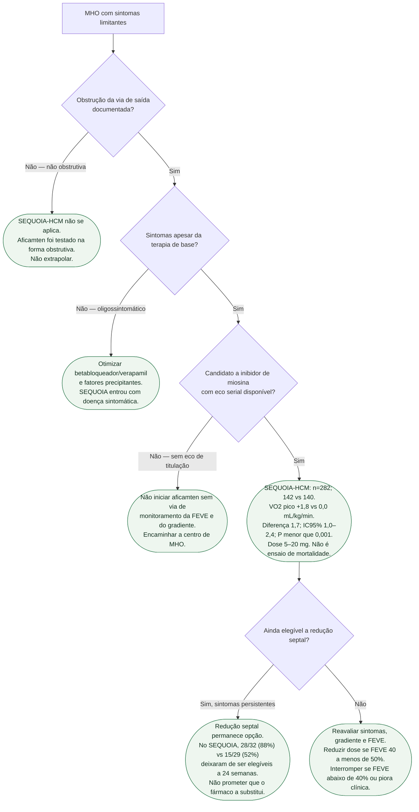

# Fluxograma: MHO obstrutiva sintomática após SEQUOIA-HCM

Pergunta desta árvore: **neste paciente com miocardiopatia hipertrófica obstrutiva sintomática, o SEQUOIA-HCM informa o uso de aficamten?** Folhas verdes são condutas. O ensaio mediu **VO₂ pico em 24 semanas**, não mortalidade nem morte súbita. Redução septal continua existindo.

## Árvore de decisão

## Números que cabem na folha C5

282 randomizados (142 aficamten, 140 placebo). Idade média 59,1 anos; 59,2% homens; gradiente em repouso 55,1 mmHg; FEVE média 74,8%. 24 semanas. VO₂ pico: **+1,8** (1,2 a 2,3) vs **0,0** (−0,5 a 0,5); diferença de mínimos quadrados **1,7** mL/kg/min (1,0 a 2,4); P<0,001. Dose inicial 5 mg, máxima 20 mg, ajustada por eco.

Carga de doença (JACC, PMID 39352339): resposta hemodinâmica completa **68% vs 7%**; queda ≥50% do NT-proBNP **84% vs 8%**; os quatro critérios de resposta **23% vs 0**.

## O que a árvore não mostra

**Mavacamten.** SEQUOIA testou aficamten. Não é comparação de cabeça. Não inventar classe ESC/AHA para aficamten neste fluxograma.

**Morte súbita e CDI.** O ensaio não informa indicação de desfibrilador. Fatores de risco súbito seguem a diretriz de MHO, não esta árvore.

**Esporte.** Aporta na porta de Cardiologia do Esporte e do Exercício; o SEQUOIA não reescreve restrição esportiva.

## Tudo com Tudo

Cardiomiopatias · Farmacologia · Insuficiência cardíaca · Reabilitação cardíaca · Comunicação clínica · Cardiologia do Esporte e do Exercício.

### Monitorização e segurança

Na bula FDA de 2025 do aficamten, não se recomenda iniciar com FEVE <55%; FEVE de 40% a <50% exige redução de dose, e FEVE <40% ou piora clínica exige interrupção. Ecocardiograma antes e durante o tratamento, revisão de interações e titulação são indispensáveis. Esses critérios descrevem a bula dos EUA; a prescrição no Brasil deve seguir o registro e a bula aplicáveis localmente.

### Leituras conectadas

- [SEQUOIA-HCM: aficamten na miocardiopatia hipertrófica obstrutiva sintomática](/biblioteca/sequoia-hcm-aficamten-na-mho-obstrutiva-sintomatica)
- [MAPLE-HCM: aficamten versus metoprolol na MHO obstrutiva sintomática](/biblioteca/maple-hcm-aficamten-versus-metoprolol-na-mho-obstrutiva)
