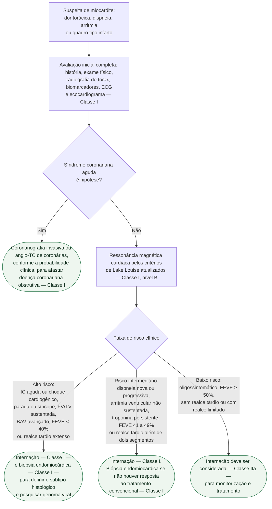
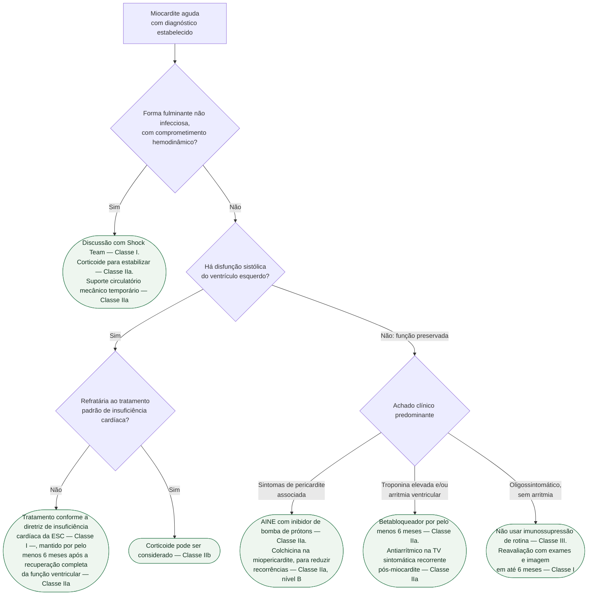

# Fluxograma: Miocardite aguda — diagnóstico, estratificação de risco e tratamento (ESC 2025)

A diretriz europeia de 2025 organiza a miocardite em torno de uma decisão que
vem antes de qualquer tratamento: **em que faixa de risco esse paciente está**.
Alto, intermediário ou baixo risco não é adjetivo — é o que define internar,
biopsiar e vigiar.

Três pontos que a diretriz fixa e que mudam conduta:

- **Imunossupressão de rotina na miocardite aguda com função ventricular
  preservada é Classe III** — não é neutra, é recomendada contra, porque não
  demonstrou benefício de desfecho.
- **A restrição de exercício é Classe I**, até a remissão e por pelo menos
  1 mês, para atletas e não atletas.
- **Betabloqueador por pelo menos 6 meses** deve ser considerado na miocardite
  aguda, sobretudo com troponina elevada.

## Árvore de decisão: diagnóstico e estratificação de risco

## Árvore de decisão: tratamento

## A tabela de risco por trás do nó `D2`

| | Alto risco | Risco intermediário | Baixo risco |
|---|---|---|---|
| **Clínico** | insuficiência cardíaca aguda ou choque cardiogênico; parada cardíaca ou síncope; fibrilação ventricular ou TV sustentada; bloqueio atrioventricular avançado | dispneia NYHA II–IV refratária ao tratamento; dispneia nova ou progressiva; arritmia ventricular não sustentada; liberação persistente ou recorrente de troponina | sintomas estáveis ou oligossintomático |
| **Imagem** | FEVE recém-reduzida (abaixo de 40%); realce tardio extenso à RM | FEVE recém-levemente reduzida (41 a 49%) e/ou alteração segmentar da contração; FEVE preservada (50% ou mais) com realce tardio além de dois segmentos | FEVE preservada (50% ou mais), sem realce tardio ou com realce limitado (até dois segmentos) |

Repare no que a tabela faz com o paciente de **fração de ejeção normal**: ele
pode estar em qualquer das três faixas, dependendo do realce tardio e da
arritmia. É por isso que a ressonância entra antes da estratificação, e não
depois.

## Por que a biópsia endomiocárdica sobe na árvore

A biópsia é recomendada (Classe I) no **alto risco** e/ou na instabilidade
hemodinâmica, e também no **risco intermediário que não responde** ao tratamento
convencional. A finalidade é dupla e concreta: identificar o subtipo histológico
— miocardite de células gigantes e sarcoidose cardíaca mudam completamente o
tratamento e o risco arrítmico — e avaliar a presença de genoma viral, que
orienta a decisão sobre imunossupressão.

Não biopsiar o paciente grave é aceitar tratar de forma genérica uma doença cujo
tratamento específico depende do que o tecido mostra.

## Sinais de alarme e o que fazer com a suspeita

A própria diretriz alerta que **o maior obstáculo ao diagnóstico é o
reconhecimento**. Os sinais de alarme para síndrome inflamatória miopericárdica
são sinais clínicos acompanhados de biomarcadores sorológicos e/ou de imagem —
e a diretriz é explícita: **sinal de alarme não é risco**. Ele levanta a
suspeita; a estratificação de risco vem depois e é ela que orienta a conduta.

## O que as árvores não mostram

**Miopericardite versus perimiocardite.** Nas formas mistas, o manejo segue o
componente predominante: quem tem **miopericardite é tratado como pericardite**;
quem tem **perimiocardite, como miocardite pura**.

**Seguimento é recomendação formal, não zelo.** Reavaliação clínica com
biomarcadores, ECG, teste de esforço, Holter, ecocardiograma e ressonância em até
6 meses da internação é Classe I em **todos** os pacientes com miocardite, para
identificar progressão ou novo fator de risco. O seguimento de longo prazo é
Classe I na miocardite complicada.

**Restrição de exercício até a remissão, por pelo menos 1 mês**, é Classe I e
vale para atletas e não atletas, com abordagem individualizada.

**Equipe multidisciplinar em centro de referência** é Classe I nos casos de alto
risco ou complicados.

**Miocardite por inibidor de checkpoint imunológico, miocardite de células
gigantes e sarcoidose cardíaca** têm recomendações próprias na mesma diretriz e
não estão representadas aqui — a primeira já tem documento próprio em
Cardio-oncologia nesta biblioteca.
