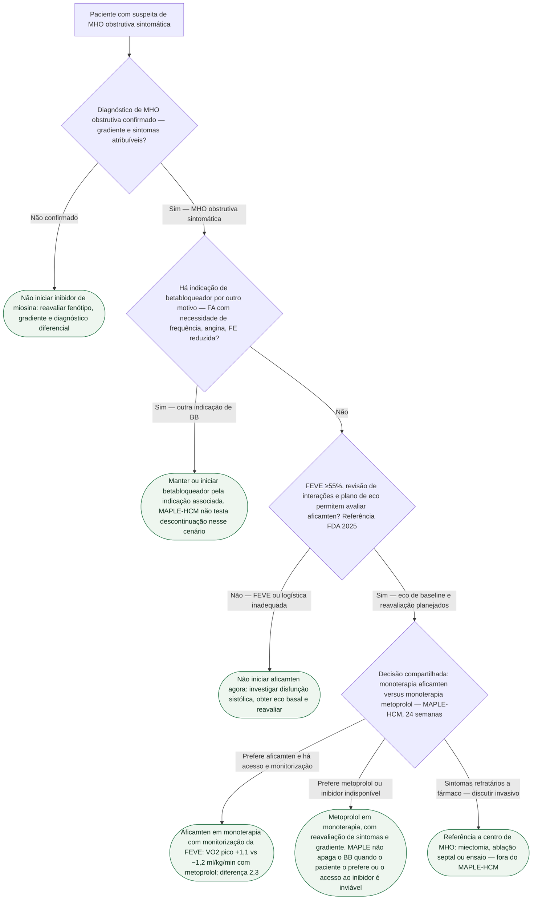

# Fluxograma: primeira linha na MHO obstrutiva após MAPLE-HCM

Árvore de **escolha de monoterapia** na MHO obstrutiva sintomática. Não é algoritmo de descontinuação de betabloqueador, nem de indicação de miectomia/ablacão septal. MAPLE-HCM mostrou superioridade do aficamten sobre o metoprolol no VO2 pico em 24 semanas (diferença 2,3 ml/kg/min; IC95% 1,5–3,1; P<0,001). Isso **não** decreta aficamten como primeira linha obrigatória em todas as diretrizes.

Os nós finais estão duplicados de propósito: a árvore não converge.

## Árvore de decisão

## Tudo com Tudo

- Cardiomiopatias
- Farmacologia
- Insuficiência cardíaca
- Comunicação clínica
- Cardiologia do Esporte e do Exercício

Referência FDA 2025 (EUA): não iniciar/aumentar aficamten com FEVE <55%. FEVE 40 a <50%: reduzir 5 mg; se já em 5 mg, interromper. FEVE <40%: interromper. Reintrodução, quando cabível, somente após pelo menos sete dias e FEVE ≥55%, em 5 mg. Eco após início/ajuste e avaliação de interações são indispensáveis. Não transpor esses limites para mavacamten nem afirmar aprovação brasileira. A indicação associada de betabloqueador não proíbe automaticamente tratamento adicional: este fluxo limita-se à pergunta de monoterapia do MAPLE.
